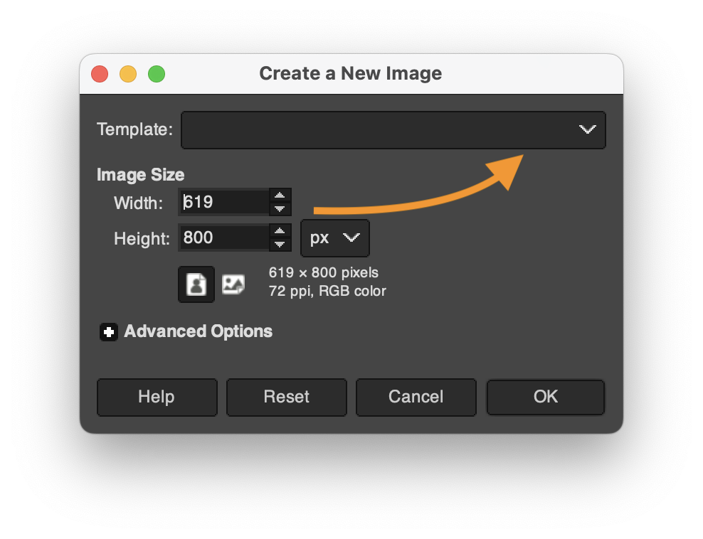

# Lesson 11: Visual Rhetorics and Argument

<section class="prereqs">
    

<strong>Texts to have read</strong>

    <ul>
        <li><a href="https://www.smashingmagazine.com/2016/05/improve-your-designs-with-principles-similarity-proximity-part-1/">Improve Your Designs With The Principles Of Similarity And Proximity (Part 1)</a>, by Jon Hensley</li>
        <li><a href="https://www.smashingmagazine.com/2016/05/improve-your-designs-with-the-principles-of-closure-and-figure-ground-part-2/">Improve Your Designs With The Principles Of Closure And Figure-Ground (Part 2)</a>, by Jon Hensley</li>
        <li><a href="https://www.smashingmagazine.com/2015/06/design-principles-compositional-balance-symmetry-asymmetry/">Design Principles: Compositional, Symmetrical And Asymmetrical Balance</a>, by Steven Bradley</li>
        <li><a href="https://www.smashingmagazine.com/2015/02/design-principles-dominance-focal-points-hierarchy/">Design Principles: Dominance, Focal Points And Hierarchy</a>, by Steven Bradley</li>
    </ul>
    

    

<strong>Work to have achieved</strong>

        <ul>
            <li><strong>Write</strong> a <a href="{{site.github.issues_url}}">visual argument proposal</a></li>
        </ul>
    

</section>

**Plan for the day**:

1. Ways of seeing: a design vocabulary (~30 min)
2. Q&A re: design (~10 min)
3. HW preview + guiding thoughts for Studio (~5-15 min)
4. Studio time!
5. Exit note (5 min)

## 1. Ways of seeing: a design vocabulary (30 min)

Consider this both a test of reading comprehension and a chance to practice some essential GIMP (or Photoshop) skills, namely (a) navigating layers, (b) manipulating layers, (c) exporting a flat file, and (d) making good use of the undo history.

    
Because there are a lot of principles, and because hands-on practice is good, we'll <strong>work in pairs</strong> today.

    
Once you've done one cycle, revert the image so you can choose a different principle and do it again – this time with the other person "driving."

For each of the visual design principles below, I'd like you to use [the student examples we've been working with](lesson-10#2b-from-flat-to-layered) to:

0. Claim one principle by writing your name next to it in our [shared notes doc](https://bit.ly/cdm{{site.course.slugterm}}-notes).
1. Identify one example of this principle at work
2. Adjust the image so as to draw attention to the principle
    * e.g. turn off the visibility to all other layers — OR, if that fails to draw the contrast you want (e.g. you need to show something _relative to_ the rest of the image),
    * instead set all other layers to 50% opacity
3. Export as .png and .jpg and check out the differences in file size and quality
4. Add the smaller of the two files to the notes doc, below your name.
5. Write a brief note next to your image explaining what you hope the picture shows.
    * e.g. "<strong>Similarity:</strong> The similar size and icon/outline style of the six items being sold emphasizes that they form a single group."
6. EXT: If you finish one, do another one. Once you've finished two, start looking at other people's examples. Use comments to add any questions you have.

NB: until GIMP 3 comes out, we can't select multiple layers at the same time. But you <em>can</em> mark the layers you want to change by using the Link option (click next to the Visibility eyeball), and you can <strong>create a new layer group</strong> and <em>drag your marked layers into it</em>. Once you've done that, you can <em>operate on the layer group</em> and <strong>everything you do to the group will apply to all the layers it contains</strong>.

### Principles of Visual Design

* Similarity: things that are alike and/or aligned are perceived as a group)
* Proximity: things that are close are perceived as a group; things that are separated are perceived as distinct
* Hierarchy of proximity > color > size > shape
* Contrast: one different thing draws the eye
* Figure-ground stability
    - color: warm colors approach the viewer, cool colors recede
    - size: large elements that fill their containers become figure
    - size: small elements in a large container become figure
    - position: lower elements become figure (read as close), higher elements become ground (read as far)
* Figure-ground ambiguity
    - equally sized elements / containers
    - high contrast of saturated colors
    - negative space forming a recognizable shape
* Balance:
    - symmetrical: equal weights on left and right
    - asymmetrical: unequal weights implying equal/opposite gravitational forces
    - radial: symmetry in all directions
    - mosaic: asymmetrical balance of many small parts
* Dominance and subordination: contrast between (three) intended layers of attention

## 2. Q&A re: design (~10 min)

What was hard to demonstrate? What was hard to understand? Or, conversely, what worked especially well?

Let's briefly look at some examples together.

## 3. Looking ahead

In a moment, I'm going to let you dive into your own projects; I'll float, and when I'm not needed I'll do my best to answer questions in the order of greatest interest. In some cases, I, too, would like to find a good tutorial: learning can be lifelong, especially with complex tasks and complex software!

For those diving in, I will ask that you begin by writing some goals and intentions in the google doc, and that you end by replying to those notes with how it actually went.

To help you think about possible goals, I want to [preview the homework](#homework-for-next-time) and share some advice that should apply broadly.

## 2. Guiding thoughts for Studio (5-15 min)

As in the past, I'm going to put these words of advice here for you to peruse at your own speed. Please do look at them before you get too far along.

Think about your canvas size

    
When you create a new project, you'll be given the option to select a width and height in pixels. But look just above that and you'll see a pull-down menu for Templates.

    <figure>
        
        <figcaption>The templates pulldown gives you a sense of standard canvas sizes.</figcaption>
    </figure>
    
Depending on what you're making, you might want to select "HD" for a landscape digital poster, "US Letter" for an easy-to-print portrait poster, "CD" for a music thumbnail, and so on.

Tips on navigating GIMP

    

Finding your tools

        <ul>
            <li>GIMP's toolbox is kinda crowded, but the tools are also helpfully indexed by category in the menu bar, under Tools.</li>
            <li>Every tool also has a keyboard shortcut, and it will save you time to memorize those for your go-to instruments. You can find the shortcuts under the menu.</li>
            <li>If your tools are hiding / nesting behind one another, but you'd prefer to see all the tools in the sidebar, you can change that setting in Preferences, under Interface > Toolbox: uncheck the Use Tool Groups checkbox.
                <ul><li>You'll find color preferences for your tool icons under Toolbox, too.</li></ul>
            </li>
        </ul>
    

    

Customizing tool defaults

        <ul>
            <li>Remember that there are often extra tips for the tool you're using under the editing window, in a tiny font; try holding shift, alt, control, command, etc while you click or drag to see what it says/does.</li>
            <li>Most of the time, these are temporary adjustments to the tool's behavior, but you can also change their long-term defaults in the Tool Settings pane.</li>
            <li>I particularly recommend changing the default behavior of the Move tool. When you first install GIMP, it's set to move whatever you click on – an exception to the usual rule that tools only apply to the active layer. For more consistent behavior, click on the "Move the active layer" toggle.</li>
        </ul>
    

    

Working with layers

        <ul>
            <li>You can rename your layers! In fact, I highly recommend it: filenames from sites like unsplash or flickr aren't known for emphasizing their content. Just double-click the layer name to highlight it and start typing. Hit Enter when you're done.</li>
            <li>A tool or effect not behaving as it should? First check that you're in the right layer.<ul>
                <li>If you are, check that the layer is big enough; you might need to use Layer > Layer to Image Size. (Or give yourself more room overall with Image > Canvas Size.)</li>
                <li>If even <em>that's</em> not working, check the tool settings area (usually below the tools, but they're movable).</li>
                </ul>
            </li>
            <li>Not only can layers be grouped so they move (and scale, and hide) together, but groups can also go inside other groups. Click the folder icon in the layers toolbox to create a new group, then drag or drop layers into it.</li>
        </ul>
    

 

Don't forget to document permissions as you go

    
It's so much easier to grab that info while you already have the page open in your browser than to try to find it again later!

    
As I hope you saw on the <a href="{{site.github_url}}/resources#visuals">site resources page</a>, there are lots of tools to help you <em>find images you're explicitly allowed to use</em>, whether with Creative Commons or other permissive licenses. Don't forget about <a href="https://search.creativecommons.org">https://search.creativecommons.org</a> and the Usage Rights options under Google's Image search (click the Tools link just above your search results).

    
You can also use copyrighted images <em>if you can make a case for it being a Fair Use.</em> That is, in either your README or your reflection (or both), you can argue that the balance of the four factors is in your favor:
    <ul>
    <li>purpose and character of the use</li>
    <li>nature of the copyrighted work</li>
    <li>amount or substantiality of the portion used></li>
    <li>market impact</li>
    </ul>
    

    
Note that this is especially important to think about if you're explicitly naming a brand or person in your proposals or planning to use their trademarked properties or images!

Remember our strategies for building unity and drawing attention

    
<em>To unify your project</em>, i.e. to help give viewers a gestalt impression that your design is a single thing, consider using...
       <ul>
          <li>repetition of shape, color, texture, etc;</li>
          <li>symmetry and alignment; and</li>
          <li>a limited number of common regions (to distinguish figure from ground)</li>
       </ul>
    

    
<em>To draw attention, draw contrast:</em> break from the repeated elements above in terms of size, color, texture, value, alignment (including rotation), or implied movement (including gaze, if you have eyes).

    
<strong>Assume that you can reliably convey only about three levels of hierarchy</strong>; after that, it starts to get mushy. At some point as you work on your proposed visual argument / rhetorical collage, therefore, you might want to reflect in writing:
       <ol>
          <li>What options do you have for your top three objects of attention? What's next in line?</li>
          <li>How would the layout need to change if you changed your ranking? That is, if you put one of your current tier-twos into the top slot, what rearrangements would that entail?</li>
       </ol>
    

## 3. Studio Time!
Some preview of the project will be due before next class, just to make sure you're all getting started on it.

Therefore, the rest of today's class is all about working on your individual projects! Find source images or text, level up on layering, watch relevant tutorials on effects or on layout, and see what happens when you apply them to your own digital canvas.

    
As usual, please <strong>set a daily goal</strong> in the <a href="http://bit.ly/cdm{{site.course.slugterm}}-notes">shared notes doc</a>, for the usual reasons: to build accountability, to seed your later reflections, and to help me find teachable moments / chances to be helpful to you.

    
Don't forget to save as you go:

       <ul>
          <li>the layered project file</li>
          <li>screenshots of your workspace</li>
          <li>meaningful commit messages, when you're satisfied with something you've made</li>
       </ul>

## 4. Quick report back (with 5 min left)

Just as a way for me to check in, I'd like to hear more about what happened today: did you find images? Level up on a particular GIMP/Photoshop skill? Which ones? Decide something about your project (what was it)? Raise a question in a new way that you'd like some help with?

    Take five minutes to reply to your own notes in <a href="http://bit.ly/cdm{{site.course.slugterm}}-notes">the doc</a>. If everyone finishes early, we can hear from a few volunteers out loud.

## Homework for next time

* _optional now, required by next week:_ **Read** Midori Nediger's blog post for Venngage (an infographics company), ["How to Choose Fonts For Your Designs (With Examples)"](https://venngage.com/blog/how-to-choose-fonts/). Notice how her advice aligns with the design principles you just read about over the weekend!

* By next class (but ideally by 10pm the night before), compose a **Visual Argument Preview**: an early snapshot of your progress, just to get the gears turning and make sure you've tested out the interface (and the feasibility of your proposed idea). To submit, please **push to your repository** the following:
    <ul>
        <li>A layered <strong>GIMP project file (.xcf)</strong> (or Photoshop .psd), showing the arrangement of your images and text so far. This need not be a complete argument or collage yet, but <em>you should have at least two layers</em>.</li>
        <li>An update to your README.md file, introducing visitors to the current state of the project. Feel free also to ask questions or lay out next steps for yourself!</li>
        <li>An updated list of <strong>assets</strong>, now with the files you're actually obtained, with their full <abbr title="Title, Author, Source, License">TASL</abbr> information.</li>
        <li>An <strong>exported "flat" .png or .jpg file</strong>. As with Audacity, GIMP's default save mode is a complex / modular "project file," of type .xcf; should the project fail to load, it would be great to have a simple image file as a backup. We won't be able to see how you achieved your layout, but we will be able to see the image. <ul><li><em>Sweet bonus:</em> if you keep the same filename for every export, you'll also be able to <a href="https://docs.github.com/en/free-pro-team@latest/github/managing-files-in-a-repository/rendering-and-diffing-images">use GitHub history to compare one .png to another</a>, side by side, or even slide to reveal the change. Pretty cool, no? (That said, I won't be mad if you want to give each exported draft its own name. Just: please don't do that for the .xcf, okay?)</li></ul></li>
        <li>A static <strong><a href="https://www.take-a-screenshot.org/">screenshot</a> of your GIMP file in progress</strong> (for later use in your reflection). If you can capture a moment of success or stuckness, all the better.</li>
    </ul>

* Where possible, bear in mind the [guiding thoughts from above](#2-guiding-thoughts-for-studio-5-15-min)
