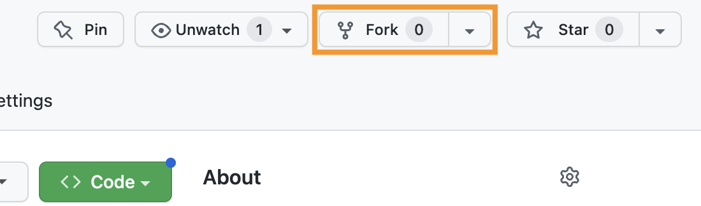
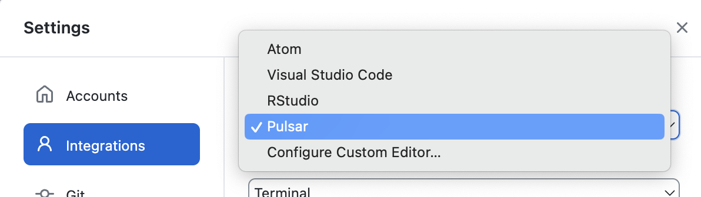

# Digital Affordances

<section class="prereqs">
    

<strong>Texts to have read/watched</strong>

        <ul>
            <li>"Five Principles of New Media: Or, Playing Lev Manovich," by Madeleine Sorapure, in two forms: <a href="https://kairos.technorhetoric.net/8.2/coverweb/sorapure/five.pdf">static text</a> and as a <a href="https://sorapure.net/five.mp4">recorded interactive</a></li>
        </ul>
    

    

<strong>Work to have achieved</strong>

        <ul>
            <li>A post to the <a href="{{site.github.issues_url}}/2">issue queue</a>, reflecting on what you noticed and wondered in your reading/watching</li>
        </ul>
    

</section> <!-- /.prereqs -->

## Plan for the day

1. Five principles of new media
2. Becoming digital
3. Audio unit assignment
4. Fork, clone, edit, push
5. Homework preview

<aside>
    Warmup: Waiting for others to file in? See if you can fill in some of the definitions from Monday in our <a href="https://bit.ly/cdm{{site.course.slugterm}}-notes">shared notes doc</a>.
</aside>

## 1. Five principles of new media

Lots of great meta-observations about the structural features of the article! I love to see the work we practice in class (thinking about interfaces) playing out again in the work you do outside of it.

I also want to make sure we get the content, too, and not *only* the structure:

Can I get five people to recap the five "principles of new media" from the webtext I asked you to read? i.e. One person, one term?

<!-- numerical representation, modularity, automation, variability,
and transcoding -->

And again, let's use <a href="https://bit.ly/cdm{{site.course.slugterm}}-notes#heading=h.u748yf582u1">the shared doc</a> to take notes. Are there a couple of volunteers to be lead note-takers today? <!-- It's a good way to participate if you don't feel like talking. -->

Once we have a shared base of understanding, we can use these terms to think about the observations you posted for homework:
- Does the pdf you read have these qualities? Does it take advantage of them, or make them easy to access?
- Does the video?
- From what you can tell, did the original Flash site?

<!-- NOTES from the discussion forum. Bring in when possible:

* Dana noted that the pdf doesn't resize! PDF makes a digital object more like a printed one.
* Josh noted that text allows skimming; timed media doesn't. Harder to have a jump scare in a book than a video.
* Maddie noted that the text and video follow the same organization, but with the video (i.e. the site) "adding design elements" to enhance the experience. Remember that the text did accompany the original article. If we think of the two versions as a kind of _progressive enhancement_, what does that suggest? Who might prefer the less "enhanced" version?
    * Carla noted that the text can get more in depth – that the interactives needed the text alongside them to provide background context and clarification.
* Shreya pointed out some weirdnesses in the text: it doesn't just describe the goal of an image (e.g. it "attempts to draw attention to the numbers and code"); it refers to "the image above," "the menu to the left." What does that suggest about the origins of this text? If the author had one more round of revision, would you take out the directional indications? What about the descriptions and goal statements?
    * Grace noted that the descriptions of visuals, and even their intent, were hard to grasp from the text alone.
    * Billy seemed to disagree, noting that "the breaks and attentions within the article act similarly to the video"
    * Mia, on the other hand, felt that "[t]he text-only depiction and video provided vastly different experiences, despite covering almost the exact same material."
    * One conclusion? **there is no truly universal design.** Multiple paths are better than just one.

* EXT: Automation has become much, much more of a thing since 2003, when this article came out; even since 2022, when ChatGPT launched the current genAI boom. We can "collaborate with the machine" in very different ways now – and more easily – than even a few years ago. And it's all changing very rapidly.
    In what ways do these ideas help you see GenAI as a break from the past, and in what ways does it help you see it as a continuation?

-->

## 2. Becoming digital

What do these framing concepts help you see about the "digital" stories you wrote last class? Or about git / GitHub itself? [Let's go back and look at it](https://github.com/benmiller314/cdm-gh-practice/blob/master/becoming-digital.md).

EXT: Pull requests and merge conflicts

## 3. The Audio Narrative assignment

As I explained in the syllabus, your first project is to **arrange layers of sound to convey a sense of place and story.** In assigning this, I have two main goals for you:

* to learn how to capture sound and edit it using digital tools, and
* to explore the affordances of sound as a medium, with particular attention to its ability to communicate
  - *immersive environment* and
  - *narrative pacing and change*.

    
Head over to <strong><a href="https://github.com/benmiller314/audio-narrative-{{site.course.slugterm}}">github.com/benmiller314/audio-narrative-{{site.course.slugterm}}</a></strong>, and <strong>fork</strong> the repo to take control of it.

    

Show me

        <figure></figure>
    

### 3a. Let's read!

The README file has additional guidelines and constraints, which I hope are generative; deadlines to give a rhythm to your production, review, and revision; and some "parachute prompts" if you feel lacking in direction and a deadline's coming up.

<!--
Go through overview, constraints, deadlines. Explain about parachute prompts.
-->

### 4. Let's practice that GitHub cycle again!

I'm going to ask you to rename the `README.md` file to `assignment.md`, so you can better signal what people will find in *your* version of this repository – but still have access to the assignment itself. Then you can write your own README.md.

And, because your project files moving forward won't be editable on the GitHub website, I want you to practice making these changes *locally* and then pushing them to the cloud.

<ol class="lalpha">
    <li><strong>Clone.</strong> In your own fork (check the URL), click on the green Code button and select the "Open in GitHub Desktop" option to download the repo to your own computer. 

Show me
<figure></figure>
</li>
    <li>
<strong>Edit.</strong> GitHub Desktop is great at noticing changes, but it's not built for editing! You'll need other software for that – in this case, your trusty text editor. Use either the "Open in Visual Studio Code" (or equivalent) button to get there directly from GH Desktop, or open your editor software and add the newly-downloaded folder to your workspace: look for a command to "Open Folder" or "Add Folder".)
 <figure></figure>

NB: If you don't see the button in GitHub Desktop, you may need to go to Settings > Integrations and browse for the editor.
 <figure></figure>
</li>
    <li><em>Rename the file</em>: Find the README.md file in the sidebar of your workspace and right-click to pull up the context menu. Renaming is a tool or feature the designers give us easy access to! <ul><li>I recommend calling the file <code>assignment.md</code>, because it's definitely a Markdown file, and it definitely contains an assignment. But you do you, as long as it has that <code>.md</code> ending. (You should also avoid spaces in filenames you might someday want to build a hyperlink to.)</li></ul></li>
    <li><em>Add a new file</em>: Right-click in an empty spot in your editor's sidebar to get another context menu, and let's make a new README.md. Make sure it's saved in the root folder of the repository (which just means it's not in a subfolder). <ul><li>Fill it with some placeholder content, like, "This is the future site of So-and-So's audio narrative." You can (and should!) update this later. Don't forget to save!</li></ul></li>
</ol>

Test your understanding: Without taking any further steps, where will you be able to see the changes you just saved? In Finder/Explorer? In GitHub Desktop? On the GitHub website?

<ol start=4 class="lalpha">
    <li>
<strong>Commit.</strong> If your files are saved, you can see them from all vantage points <em>on your own computer</em>. But you can't share them with the world unless you're ready to give them a label and enter them into the historical record.

    
Head back to GitHub Desktop, and note that <em>you can commit multiple files in one go</em>, as long as there's a consistent description you can attach to that multi-file change. Which there is in this case, no?
</li>
</ol>

Test your understanding: Without taking any further steps, where will you be able to see the changes you just committed? In Finder/Explorer? In GitHub Desktop? On the GitHub website?

<ol start=5 class="lalpha">
    <li>
<strong>Push.</strong> Yup, there's one more step before everything's out in the world. With a commit, you've sealed the package and made it ready for transit, but you haven't actually sent it.

Note that this means you can make a bunch of commits on your way to a draft, and push them only when you feel it's ready to share.
<ul><li>NB: As long as your changes are only local, you can amend your most recent commit (e.g. change the message, change which files it includes); once it's on the internet, you'd have to do some deep magic to change history. But don't worry: you can always <em>add</em> edits, including to revert changes, if you need to.</li></ul></li>
</ol>

EXT: If we finish the above with 20 minutes to spare...

    <h3>Generative loop writing</h3>

    
The project proposal isn't due for a little while, but if we have time today, we can get the process started, so your ideas have more time to percolate. If we don't have time for this exercise today, we'll just come back to it next week.

    
For the next fifteen minutes or so, we'll use in-class time using writing – some listing and looping – as a way to get your ideas flowing. <strong>As I ask the following questions, pause and reach out with your feelings until you sense an answer, or more than one, and then write down whatever comes.</strong> I won't collect these, so they're private to you. But I hope you'll find them useful for getting to something shareable, moving forward.

    <ol>
        <li>
            
In the process of writing with sound, you're going to spend a big chunk of time listening and relistening and looping, so you want to pick a place you're likely to enjoy hanging out in.

            
What <em>places</em> (physical, virtual, or imaginary) come to mind as energizing for you to unpack into layers, and reassemble? In other words: within what <em>soundscapes</em> might you anchor your narrative? <strong>Make a list.</strong> Anything you're forgetting?

        </li>
        <li>Choosing one item from your list you could work with for now, ask yourself: How would you represent that <em>environment</em>sonically?
            <ul>
                <li>e.g. What sounds are relatively stable, or sustained, in that place? </li>
                <li>e.g. What incidental, or foreground, sounds do you associate with that place?</li>
            </ul>
        </li>
        <li>Still in the same environment: What kinds of <em>stories</em> happen there? Again, make a list. </li>
        <li>Look over your list of stories, and ask yourself: Which of these could you reasonably tell within a few minutes? Which are long enough to tell <em>for</em> a few minutes?</li>
        <li>Choosing one story to work with for now – you can always come back to other items on the list over the weekend – ask yourself:
            <ul>
                <li>What are the pieces of this story? What are the actions, structures, or sequences?</li>
                <li>How would you represent each action <em>for audio</em>? What sounds, signals, or setups could help a listening audience know what was happening?</li>
            </ul>
        </li>
    </ol>

## HW for next time:

There's no class on Monday, Jan 20, for MLK Day. We'll be back on Wednesday, Jan 22, so aim to complete the assignments below by 10pm on Tuesday, Jan 21.

First, some intellectual stimulation:

* **Read** chapter 6, "Working with Multimodal Assets and Sources," from the textbook _Writer/Designer_ (edited by Ball, Sheppard, and Arola). A <a href="https://ebookcentral.proquest.com/lib/pitt-ebooks/reader.action?docID=6745793&ppg=229">digital copy</a> is available through Pitt Libraries.
* **Listen** to the following student projects, each running 2–5 minutes, each shared with permission: <!-- Reading the READMEs is an EXT. NOTE TO SELF: also assign the reflections for these when we get close to that, if only as an EXT at that time -->
<!-- update each time with examples from this class where possible -->
  - Barner, Tyller. "Coffee Shop Conversations." *Digital Media and Pedagogy Showcase Spring 2019.* [http://dmap.pitt.edu/node/248](http://dmap.pitt.edu/node/248).
  - Joo, Jackie. "Come Over for Dinner." *Composing Digital Media Spring 2021.* (The showcase became... complicated by the pandemic.) [access via GitHub repo](https://github.com/jackie216/soundscape2021spring): filename [Come-Over-For-Dinner-final.mp3](https://github.com/jackie216/soundscape2021spring/blob/master/Come-Over-For-Dinner-final.mp3?raw=true). Description in the [repo README](https://github.com/jackie216/soundscape2021spring/blob/master/README.md).
  - Kozierok, Evan. "The King of the Jungle." *Composing Digital Media Spring 2022.* [access via GitHub repo](https://github.com/evankozierok/soundscape2022spring): filename [soundscape.mp3](https://github.com/evankozierok/soundscape2022spring/blob/master/soundscape.mp3?raw=true). Description and transcript available from the [repo README](https://github.com/evankozierok/soundscape2022spring#readme).
  - Quaid, Fatema. "A Haunted Halt." *Digital Media and Pedagogy Showcase Fall 2019.* [http://dmap.pitt.edu/node/295](http://dmap.pitt.edu/node/295).
  - Adams, Ben. "Spent on a Rainy Day." *Composing Digital Media Spring 2023.* [access via GitHub Repo](https://github.com/BenA03/audio-narrative-2023spring): filename [audio-project.mp3](https://github.com/BenA03/audio-narrative-2023spring/blob/6ce743be357a18c4d3df0e8d3c349a870bef2f3f/audio-project.mp3?raw=true).

Second, some writing (because this is a W class, after all!):

* **Write** another short blog post (~200–500 words) to the new thread [on the issue queue]({{site.github.issues_url}}):
    - What do you notice, i.e. what stands out or catches your attention while reading or listening? Was anything surprising? Locate us somewhere in the "text," whether it's one of the student examples or the chapter on assets and sources.
    - What does that suggest, or what does it make you wonder?
    - _optional but encouraged:_ If you're one of the first five to post, see if you can pose a question for your classmates. If one of the questions speaks to you, do your best to respond to it – you can use `@username` to signal whose question you're addressing.

Finally, some nuts-and-bolts preparation:

* **Download** the [Audacity 3.7](https://www.audacityteam.org/download/) audio editor, or update to the latest version if you already have it.
   - NB: some source sites will try to trick you into downloading unrelated software. Don't fall for it. Start on the audacityteam.org page, and read the links carefully.
   - *Optionally* also download the [separate FFmpeg import/export library](https://manual.audacityteam.org/man/faq_installing_the_ffmpeg_import_export_library.html), which expands the file types Audacity can handle. Might be useful for imports from your phone, depending on your device!
   - *Optionally* download a phone recording app. Your device may already have a decent default voice recorder that you can use; let the class know if you have suggestions (or anti-suggestions). I've had success with Parrot in the past.
* **Watch** this [Audacity tutorial](https://www.youtube.com/watch?v=Im2W7pokfpw), by Kyle Stedman, one of the editors of [_Soundwriting: A Guide to Making Audio Projects_](https://broadviewpress.com/product/soundwriting); it's about 18 minutes long at 1x speed. Come in ready to play with the software (and ask any questions that come up)
* **Pack** headphones – we should have time to practice!

_Optional:_ This will be part of the homework for next week, but there's no class on Monday and then you'll also be writing a proposal over the weekend between lesson 04 and lesson 05. If you feel like you'll have more time now, you may want to get a head start on this advice on sound recording, _listening to the embedded clips_. If not, no worries! You can do it next week.

- Fowkes, Stuart. “The Top 5 Things You Need to Make a Great Field Recording.” *Cities & Memory: Field Recordings, Sound Map, Sound Art*, 13 Aug. 2014, [https://citiesandmemory.com/2014/08/top-5-things-need-make-great-field-recording/](https://citiesandmemory.com/2014/08/top-5-things-need-make-great-field-recording/).

- MacAdam, Alison. “6 NPR Stories That Breathe Life into Neighborhood Scenes.” *NPR Training*, 30 Oct. 2015, [https://training.npr.org/audio/six-npr-stories-that-breathe-life-into-neighborhood-scenes/](https://training.npr.org/audio/six-npr-stories-that-breathe-life-into-neighborhood-scenes/). (**Note the time skips she recommends**: sometimes a long clip is embedded, but not meant to be listened to in full.)
