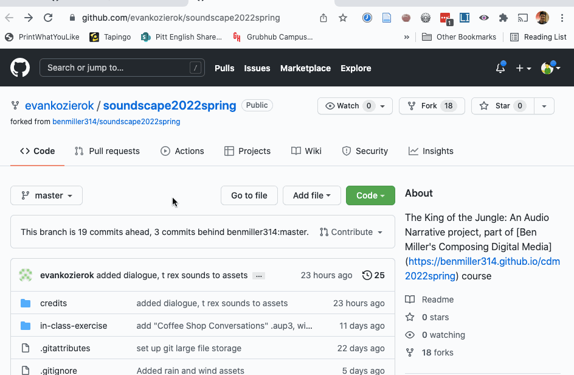
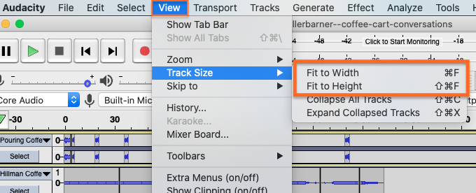
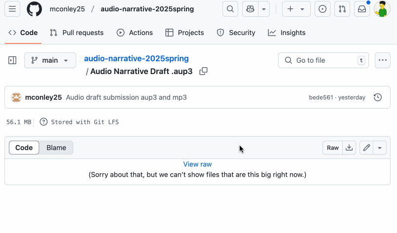

# Sound Unit Workshop

**Work to have done**: a solid attempt at a complete audio narrative, ideally meeting <a href="https://github.com/benmiller314/audio-narrative-{{site.course.slugterm}}?tab=readme-ov-file#generative-constraints">baseline criteria</a>. Rough edges are still welcome.

**Plan for the day**:

1. Warm-ups and prep
2. Describe -> Evaluate -> Suggest: A Workshop Workflow (5 min)
3. Evaluation reminder: our shared criteria (5 min)
4. Peer review workshop (3 times 10-12 min); EXT: Studio
5. Evaluation revisited (10 min)
6. Homework for next time

## 1. Warm-ups and prep

NB: It's a workshop day! If you have more than one Audacity project file in your repo, to make this process easier, you should probably indicate in your README.md file where to find the main .aup3 file for your project. Take a minute to do that now, if you need to.

In your own space, think about writing you've had reviewed before, whether by peers or by teachers. What were the best, most helpful responses? What were the worst, least helpful responses?

Based on that, **what could you do to make responses that _you_ give less like the worst, and more like the best?** Jot down some notes and reminders for yourself.

<!-- A lot of peer review fails because it falls to one of two extremes: noncommittal nods, or non-stop nitpicking. Neither really takes advantage of the output we have in front of us. Describe/Evaluate/Suggest helps avoid some of the potential pitfalls of peer review. -->

## 2. Describe -> Evaluate -> Suggest: A Workshop Workflow (5 min)

Today is all about getting _feedback_ for your projects. What does that metaphor mean? It's a process by which the output is picked up again as input. That means your job as a peer reviewer is to _return their outputs to them_, with a little added distance: to help them see what's coming across, so they can compare it to what they'd intended. <!-- A lot of times as writers, including as soundwriters, we don't even know if our audience is getting the main point we want to get across. This is a way of finding out. -->

To make that work, I'm going to insist that you provide this feedback in three steps:

    <ol>
        <li> First, <strong>describe</strong> what you hear, <em>without judging whether it's good or not</em>. What is this project? What do you think is happening? What seems to be the focus? What stands out? </li>
        <li>Next, <strong>evaluate</strong> <a href="https://github.com/benmiller314/audio-narrative-{{site.course.slugterm}}?tab=readme-ov-file#generative-constraints">according to our shared criteria</a>, in light of the focus you perceive in the project. Note that this is still a form of description: It's not about "good" or "bad" in the abstract but about where it meets or misses the shared or stated goals.</li>
        <li>Finally, <strong>suggest</strong> some revision possibility that you think might help take the project to the next level: we know these are drafts, so assume a revision is on the way. Given the goals, the focus, the criteria, what might be next? <!-- Pose your comments as a suggestion, not a command: and interpret comments you receive as suggestions, not commands. --></li>
    </ol>

## 3. Peer Review Workshop (3-5 min setup, plus 10-12 min for each of 3 partners)

You're going to **download an audio narrative, as specified below,** and write your feedback for the author _on GitHub_. We'll start in sync for a little while, just so I know everyone can find the files and where to post the feedback.

Then you'll repeat the cycle two more times.

### Your Groups

Within each group, **you're responsible for commenting on the three (3) people that follow you in your line**; if that takes you to the end of the line, wrap around again.

* <a href='https://github.com/wex59/audio-narrative-2025spring'>Weini</a>, <a href='https://github.com/mschnelk/audio-narrative-2025spring'>Mia</a>, <a href='https://github.com/reagan-h6/audio-narrative-2025spring'>Reagan H</a>, <a href='https://github.com/2004Moonlove/audio-narrative-2025spring'>Yang</a>, <a href='https://github.com/JoshKrym/audio-narrative-2025spring'>Josh</a>
* <a href='https://github.com/morganfilar/audio-narrative-2025spring'>Morgan</a>, <a href='https://github.com/raeganbest/audio-narrative-2025spring'>Raegan B</a>, <a href='https://github.com/erinkelly25/audio-narrative-2025spring'>Erin</a>, <a href='https://github.com/DAB367/audio-narrative-2025spring'>Dana</a>, <a href='https://github.com/src141/audio-narrative-2025spring'>Shreya</a>
* <a href='https://github.com/mconley25/audio-narrative-2025spring'>Maddie</a>, <a href='https://github.com/davidaltman920/audio-narrative-2025spring'>David</a>, <a href='https://github.com/longworthgrace23/audio-narrative-2025spring'>Grace</a>, <a href='https://github.com/Cferzoco/audio-narrative-2025spring'>Carla</a>, <a href='https://github.com/gavin-abramowitz/audio-narrative-2025spring'>Gavin</a>
* <a href='https://github.com/WLD10/audio-narrative-2025spring'>Billy</a>, <a href='https://github.com/daminidwivedi/audio-narrative-2025spring'>Damini</a>, <a href='https://github.com/hanbos09/audio-narrative-2025spring'>Hannah</a>, <a href='https://github.com/wills-projects/audio-narrative-2025spring'>Will L</a>

e.g. Weini will reflect back audio narratives for Mia, Reagan H, and Yang; Mia will reflect back for Reagan H, Yang, and Josh; but Reagan H will reflect back for Yang, Josh, and Weini; and so on.

What to do if your partner's draft is missing

    <ul>
        <li>If one of your partners hasn't turned in a draft, first check with them to see if they need help getting their files onto GitHub.</li>
        <li>If they're not yet ready to post, skip to the next person in your row.</li>
        <li>If by skipping you've wrapped all the way around, but you've left at least one comment, you can reclaim the rest of the time for studio.</li>
        <li>If you've wrapped all the way around and still don't have even a single a draft to respond to, jump down to the next row so you can give at least one comment today. It's to your benefit, too!</li>
    </ul>

<aside class="alert alert-white">
If you're absent from class but not too sick to participate asynchronously, please try to complete your review <strong>before our next class</strong> – or earlier, if possible – so your partners can work with your feedback in mind. <strong>If that's just not possible (and I understand how that might be the case), let me know asap</strong> and I'll make sure your partners get feedback from me in the meantime. <!-- Saturday morning would be the latest when it might still be helpful, so that's the official async deadline; just confirm that you've pulled the latest version whenever you start. -->
</aside>

### Detailed instructions for workshop

<ol>
    <li>
        
Open your first partner's repo on the GitHub website. If you had a fast connection and lots of disk space, you could clone (e.g. with the "Open with GitHub Desktop" option under "Code"); however, since we're all trying to do this at once, I think it makes the most sense to <strong>download just the aup3 file.</strong> (It'll be plenty big enough!)

        
NB: I think it might be best to <strong>download and respond to one project at a time</strong> – after that first one, we'll likely stagger, and so use less of our available bandwidth at the same time, making everything go more smoothly.

    </li>
    <li>
        
To do so, <strong>find the file and <em>click on its filename</em></strong> (that is, not on the commit message, but the link that includes the .aup3 ending). If you can't find the file, ask the creator!

        
You should get a new screen that says "Stored with Git LFS" and a Download button (or the  icon). (If you don't see that button, try the three-dots menu.) Go ahead and click Download.

        
If given the option, <em>save the file anywhere that <strong>isn't</strong> your own repository</em>. You may want to give it a name that distinguishes it from other partner's files, e.g. by appending your classmate's name.

        

Show me

            <figure role="figure">
                
                <figcaption>To download a single file from GitHub, click on that file's name. <em>GIF made with <a href="https://www.cockos.com/licecap/">LICEcap</a></em>.</figcaption>
            </figure>
        

        
Be patient: this might take a little while.

    </li>
    <li>
        
When it's ready, open the file in Audacity. Optionally, zoom out to see the whole Audacity project with View > Track Size > Fit to Height / Fit to Width.

        

Show me

            <figure role="figure">
                
                <figcaption>View menu options. Keyboard shortcuts can adjust track sizes as well.</figcaption>
            </figure>
        

        
Note that you can later use the same menu to Expand All Tracks; this will let you see the settings for pan, gain, etc.

    </li>
    <li>
Here's where the cycle really starts:

        <ol>
            <li><strong>describe</strong> the soundscape and narrative you hear</li>
            <li><strong>evaluate</strong> the project relative to the shared set of criteria, and</li>
            <li><strong>suggest</strong> changes that you think would take it to baseline and/or above.</li>
        </ol>
        <aside class="alert alert-info">NB: In years past, I asked everyone to fit comments on index cards; that should give you a sense of how much writing I'm expecting here. (ie, it should be relatively focused.) But it's a little more environmentally friendly to write digitally instead.</aside>
    </li>
    <li>
        
To share your feedback, you'll <strong>post it through the GitHub web interface, as a comment on the project's latest commit</strong>. 

        

Show me

            
If you still have the .aup3 file page open, look for a hyperlinked jumble of 7 letters and numbers near a timestamp and a clock symbol; it's usually straight up from the download button. Clicking there should show you the diffs – i.e. what's changed in this commit. Scroll to the bottom, and you'll see a comment box very similar to what you've used on the Issue Queue. Leave your describe/evaluate/suggest notes there!

            <figure role="figure">
                
                <figcaption>You can leave comments on any particular commit using the GitHub website. <em>GIF made with <a href="https://www.cockos.com/licecap/">LICEcap</a></em>.
                </figcaption>
            </figure>
        

        
You can also access the full history for a repo – and see any comments - from the repo's landing page. Look for the  symbol.

    </li>
    <li>Repeat the steps above for your next two partners' repos. On subsequent loops, note that (<em>after</em> viewing/listening to the project first) you may also want to read and/or refer to the previous comments.</li>
</ol>

Let's do this!

## EXT: Studio
If any time remains, go ahead and get started on those revisions! You can let me know in the [shared notes doc](https://bit.ly/cdm{{site.course.slugterm}}-notes) what you're working on – or what you're wondering.

## 3. Evaluation reminder: our criteria (5 min)
We set up [a few shared goals and constraints](https://bit.ly/cdm{{site.course.slugterm}}-notes) that meet the baseline requirements. Let's try to help everyone get at least to there!

<a title="as of Wed 2025-01-29">Baseline Requirements</a>

    
For a minimum grade of B, all projects for this unit <em>must</em>...

    <ul>
        <li>Play for 1:30-4 minutes</li>
        <li>Have something happen or change during the piece (e.g. a shift in location, a discrete event)</li>
        <li>Contain at least one sound originally recorded by you</li>
        <li>Contain at least one sound not recorded by you, but which you have permission (e.g. Creative Commons license, fair use, etc) to use</li>
        <li>List and credit file sources used, including your means of establishing permission</li>
        <li>Have three layers (tracks) of sound overlapping at least once in the file</li>
        <li>Meet deadlines and requirements from the chart below (see: citation, reflection, project title in README)</li>
        <li>Export a playable ("rendered") .mp3 file</li>
    </ul>

<a title="as of Wed 2025-01-29">Aspirational Inspirations</a>

    
To target (but not guarantee) a grade above a B, the best projects for this unit <em>may</em>...

    <ul>
        <li>Use relative volume and other effects to signal distance</li>
        <li>Use left/right pan and low/high pass filters to create a sense of (locations in) space</li>
        <li>Have a clear organizational scheme you can articulate in your reflection
        <ul dir="auto">
        <li>e.g. Seamlessly blend clips from disparate sources</li>
        <li>e.g. Use sharp cuts to signal scene changes</li>
        <li>e.g. Have an emotional or intellectual arc reflected in background music</li>
        <li>etc.</li>
        </ul>
        </li>
        <li>Show evidence (e.g. from workshop feedback) that audience interpretation matches what you intended</li>
        <li>Use Audacity effects or tools that are new to you</li>
        <li>Write clear commit messages that signal your process and progress</li>
        <li>Include a text transcript of your audio file for accessibility and improved search</li>
        </ul>

## 4. Evaluation revisited (10 min)
Based on your viewing, if you'd like to propose changes to the baseline criteria, or add new aspirational goals for others to consider, please comment on the [google doc](https://bit.ly/cdm{{site.course.slugterm}}-notes#heading=h.a7m7rjwmokeg)!

# Homework for Next Time

* Continue to **save, commit, and push** toward your project, incorporating feedback from partners.
    - If you didn't get feedback from three partners, please **let me know** asap! I'll prioritize you for my own feedback.
    - Likewise, if you haven't finished *giving* feedback, please do so asap, and no later than noon on Wednesday for full credit.
* **Next class will be a soundwriters' studio**: a chance to carry forward with your plans, in light of the feedback from workshop.
    - **Bring headphones** so you can work in class.
    - The goal is to produce a final-for-now draft by the end of Sunday, which should give you time to write a reflection by class-time on Monday; see the [audio narrative prompt](https://github.com/benmiller314/audio-narrative-{{site.course.slugterm}}) for further details. I know it's fast! You'll have a chance to choose a project to revise or refine in the final unit of the class.
* For that reason, even as we zoom in toward the unit finale, I want to keep one eye open toward the bigger picture. e.g. What more might you want to explore? How might your project, or audio, fit into a larger context? Or what do you know you won't have time for now, but maybe could look into and build toward by the end of the term?
    - You can post these musings to the [Issue Queue]({{site.github.issues_url}}); there is no minimum length requirement.
