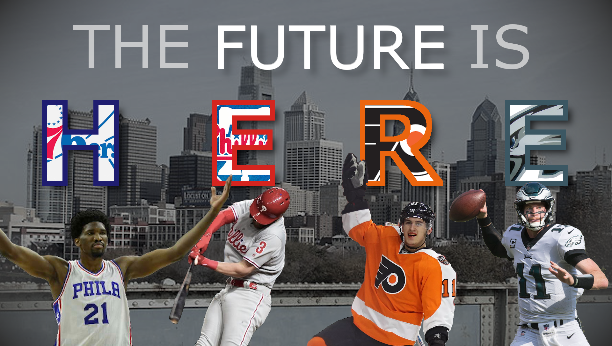
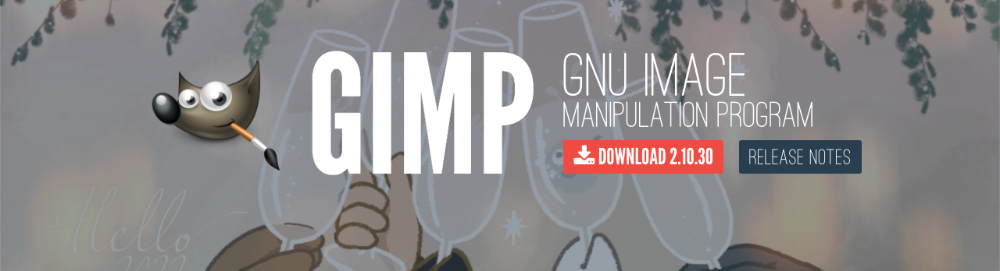

# Can You Picture It? Generating Visual Ideas

<section class="prereqs">
    

<strong>Work to have achieved</strong>

        <ul>
            <li>A final-for-now version of your soundscape narratives, pushed to your own GitHub repo</li>
            <li><a href="{{site.github.issues_url}}/6">post reflection on same</a></li>
        </ul>
    

</section>

First, congratulations on finishing your first project for the class! Take a deep breath!

**Plan for the day**:
<!-- Have GIMP already running in the BG, to save startup time -->
1. Some long-delayed introductions  <!-- (15-20 min) -->
2. Visual unit overview <!-- -->
    - An example
    - Group exercise: training our eyes to see claims
3. Visual unit assignment and schedule
4. Loop writing and drawing
5. Homework for next time

<!-- Here I decided to cut the writing & discussion of sound as medium and software as trying to make the difficult things easier. It was never quite as productive as I would have wanted, and it's an energy drain. See 2023spring if you need it back. -->

## 1. Some long-delayed introductions

We had some fluctuations in our roster for the first couple weeks, then illness for the next couple. I'm _hoping_ we'll have a full crew today, but at any rate, it's long past time for us all to get to know each other's names!

We'll use the second person to tell each other, "You are <em>[name]</em>. And I am <em>[myname]</em>."

* And we'll do this <em>cumulatively</em> around the room: each person adds their own new name at the end of the list-so-far – still in second person until their own name.
* As you say each name, make direct eye contact with the person you're talking to. This puts them right in the center of your field of vision, improving memory retention.
    - To make this more possible, let's stand up for a few minutes, if you're able, to make a circle (or rectangle-ish thing, anyway) around the room, without monitors in the way.
* As we go, everyone should be trying to learn the names at the same time: your turn to talk, then, is not the only turn that matters. Help everyone make that eye contact.
* If you can't remember someone's name, just make eye contact, apologize, and ask.

I'll start!

## 2. Visual unit overview

Your second project is to **make a rhetorical claim through the juxtaposition of images and text.** It's kind of a collage, but a collage with an _argument_ to make, an _intervention_ in the world.

<!-- SAVE THE BELOW, I think, for when we open the full repo. Makes that second look less redundant. Hopefully.

In assigning this, I have two main goals for you:

1. to learn how to capture images and arrange them using digital tools, and
2. to explore the affordances of still images as a medium, and especially their ability to _direct attention_ and _help make ideas memorable_. -->

### For example

Here's a project from a previous semester:
<figure role="figure">
    
    <figcaption>"The Future of Sports." <a href="https://github.com/ktdemay/visual-argument-2020spring">Kevin DeMaioribus</a>, 2020.</figcaption>
    

        
Though unnamed in the image, the athletes/teams are, from left to right, Joel Embiid of the Philadephia 76ers (basketball), his arms raised to either side; Bryce Harper of the Philadelphia Phillies (baseball), with a bat in mid-swing; Travis Konecny of the Philadelphia Flyers (hockey), one hand waving; and Carson Wentz of the Philadelphia Eagles (football), preparing to throw.

    

</figure>

#### Initial questions to ask

* Where is your attention drawn? e.g. What takes up the most area? What's given high contrast, in color or size?

Based on that, what do you think the creator was trying to claim? What intervention was he making?

### Group exercise: training our eyes to see claims

Here are some more student examples in response to this actual assignment:

<ol class="ualpha">
    <li><a href="https://github.com/csk32/visual-argument-2020fall/blob/master/Human_Trafficking_updated.png">Human Trafficking</a>, by Christianna Kelley</li>
    <li><a href="https://github.com/fathimashabnam/visual-argument-2019fall/blob/master/VisualArgument.png">The Extinction Crisis</a>, by Fathima Shabnam</li>
    <li><a href="https://github.com/emmaknaub/visual-argument/blob/master/visual_argument.png">Radiate</a>, by Emma Knaub</li>
    <li><a href="https://github.com/anayoungblut/visual-argument-2023spring/blob/main/FINAL/Screen%20Shot%20final%202%3A26.png">Don't Do It</a>, by Ana Youngblut</li>
    <li><a href="https://github.com/suchiattota/visual-argument-2023spring/blob/main/TheCoverUp.png">The Cover-Up</a>, by Suchi Attota</li>
</ol>

    
Look through these images, starting with the letter that corresponds to your table. <strong>Discuss with your tablemates:</strong>

    <ul>
        <li>What argument is the piece making?</li>
        <li>How does the <em>visual</em> contribute to that argument?</li>
        <li>What does the <em>text</em> add that the visual couldn't do on its own?</li>
    </ul>
    
Take notes in the <a href="https://bit.ly/cdm{{site.course.slugterm}}-notes">shared notes doc</a>.

EXT: When you're done talking about your table's starter piece, move to the next, wrapping around as needed.

Let's discuss!

## 3. Visual unit assignment and schedule

To read the full assignment – and make a copy for yourself – go to <strong><a href="https://github.com/benmiller314/visual-argument-{{site.course.slugterm}}#project-2-visual-argument--rhetorical-collage">github.com/benmiller314/visual-argument-{{site.course.slugterm}}</a></strong>.

Let's read through this together, including the timeline and the parachute prompts.

<!-- Go through overview, constraints, deadlines. -->

## 4a. Loop writing <!-- Takes at least 15 min, so start no later than 1:55, ideally 1:45 or 1:50 -->
<aside class="alert alert-info">
NB: For this generative exercise, adapted from <a href="http://bit.ly/perlfeltsense">one by Sondra Perl</a>, you'll need somewhere to write and somewhere to <em>draw</em>. For the latter, printer paper is great; a notebook is also okay; the computer's probably not, unless you're experienced. I like pencil, but your preference may vary.
</aside>

Let's take a few minutes to think in writing about the visual arguments you might want to make. I'll read a series of questions aloud. Repeat them silently to yourself, and when you feel yourself answering, make a list.

These lists will remain private, unless you choose to share. I won't ask for them.

1. What ideas do you want help remembering?
2. Or what do you want to persuade others of?
3. Is there something you've noticed that you want to bring to the attention of others?
4. Is there anything else you'd like to add? Something from a course? From an activity or group you participate in? Something you've been reading about? (If there's an idea you thought of working on before coming to class today, be sure to add it now.)

Take a moment now to read back over your lists. Is there something that stands out, that says, _me, pick me_? Choose one thing to work with, at least for today, and mark it in some way. Then copy it into a clean page.

With that chosen subject, write again:

<ol start="5">
    <li>What terms or images come to mind when you think of this subject? ... Think about categories of words: actions vs things. Descriptors.</li>
    <li>Is there anything you're forgetting to add to your list? A line from a song? A color?</li>
    <li>Who else might be interested in this? Who, that is, could be your audience?</li>
</ol>

See if you can summon up the whole of this idea, like it's right here in the room with you. Where does it live? Is it above you? Inside you? In the palm of your hand? Just sit with your idea for a moment, feeling where you connect to it.

### 4b. Offline sketching (10 min)
And now, draw. Take a piece of paper, divide it in quarters (e.g. by folding in half both ways), and in each quarter sketch out some possibility, some version, of what your idea might look like.

If you can, try to make each image significantly different from each other, to give you options; you can use your lists for inspiration. If you can't think of very different ones, then work to make just _some_ change.

We'll work here for a while.

NB: The proposal isn't due until next week, so don't worry if you don't have a clear plan yet.

EXT: Getting into GIMP

    
The software I'm asking you to use is <a href="https://www.gimp.org/downloads/">GIMP</a>: the <abbr title="GNU, in turn, stands for _GNU's Not Unix._ Yyup.">GNU</abbr> Image Manipulation Program.

    <figure role="figure">
        
        <figcaption>Header image from GIMP website. Click to visit www.gimp.org.</figcaption>
    </figure>

    
I want to do just a quick preview today, while we're thinking about the shape of tools – and then we'll focus on what I'm asking you to do with them. We'll have more time to play with the software next time, after you've seen a 20-ish minute video introducing the basics.

    
Let's go back to Kevin's "The Future is Here" visual argument. If we open it in GIMP, how does the software tell us what's present, and what's possible?

    <!-- We can ask the same questions of the interface as we did before of the image as a whole. But I'm also interested in whether/how the interface enacts or thwarts your expectations. -->
    <ol>
        <li>Where is your attention drawn? e.g. What takes up the most area? What's given high contrast, in color or size?</li>
        <li>What's grouped together? Can you tell why, or by what principle?</li>
        <li>What features/tools do you have quick access to? For instance, what can you interact with directly? What buttons or menus do you have, whether in a toolbar or when you right-click?</li>
    </ol>

    <!-- Note that these are the same questions I asked of GitHub and Pulsar. -->
    <!-- give tour: layers at bottom right, tools at upper left, tool options at lower left, undo at top right. -->
    <!-- Toggle visibility. -->
    <!-- Toggle groups. -->
    <!-- Duplicate -->
    <!-- Warning about raster graphics: can scale down, but not up -->

    <aside class="alert alert-white">
        
There are lots of tutorials out there, including right on the GIMP website. If you ever get stuck, try their aptly named <a href="https://docs.gimp.org/2.10/en/gimp-getting-unstuck.html">Chapter 4: Getting Unstuck</a>. (I've also put some other resources on the <a href="{{site.github.url}}/resources">resources page</a>, and please feel free to suggest others as you find them!)

    </aside>

## Homework for next time

We'll start working with GIMP next class. To get ready, you'll need some software...

* **Download and install** [GIMP](https://www.gimp.org/downloads/) if you haven't already
* **Watch** [Learn GIMP in 20 Minutes](https://www.youtube.com/watch?v=w0quo4S8Oqw) from Chris' Tutorials.

and also some food for thought...

* **Read** [An exercise in frustration](https://www.aiweirdness.com/an-exercise-in-frustration/) by Janelle Shane (from her blog, AI Weirdness; Medium calls it a 6-minute read)
* **Also read** [the Facebook post Shane links to](https://www.facebook.com/groups/1404116417142065/posts/1459674184919621/) in her opening line
<!-- * **Find** an example of a rhetorical visual design (on your own) -->

and let's start thinking as a community:

* **Write** a short blog post, about either the reading or the video. What do you notice? What do you wonder? Post this on <a href="{{site.github.issues_url}}">the Issues page</a>.
    - _optional:_ If you're one of the first five to post, I encourage you to pose questions for your classmates; if you're not, I encourage you to respond to them.

NB: We'll have studio next class. Bring headphones for <a href="https://www.noisli.com/">sonic isolation</a>, if you'd like

