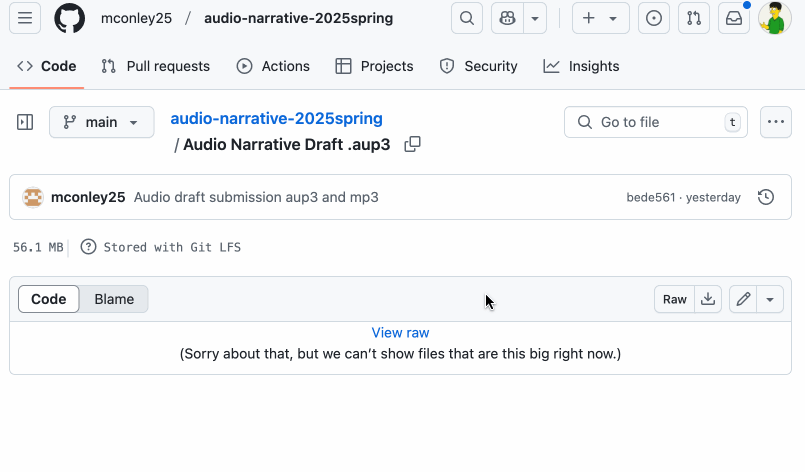

# Visual Unit Workshop

<section class="prereqs">
    

<strong>Texts to have read</strong>

        <ul>
            <li>A post about <a href="https://venngage.com/blog/how-to-choose-fonts/">choosing fonts</a></li>
            <li>Resources from the [../resources page]</li>
        </ul>
    

    

<strong>Work to have achieved</strong>

        <ul>
            <li>a solid attempt at a complete visual argument, ideally meeting <a href="https://github.com/benmiller314/visual-argument-{{site.course.slugterm}}?tab=readme-ov-file#generative-constraints">baseline criteria</a>. Rough edges are still welcome.</li>
        </ul>
    

</section>

**Plan for the day**:

1. Workflow Reminder: Describe -> Evaluate -> Suggest (5 min)
2. Evaluation reminder: our shared criteria (5 min)
3. Peer Review Workshop (3 times 10-12 min)
4. Evaluation revisited (10 min)
5. HW Preview

NB: It's a workshop day! If you have more than one project file in your repo, make sure you <strong>indicate in your README.md</strong> where to find the main .xcf or .psd file for your project.

Take a minute to do that now, if you need to.

## 1. Workflow Reminder: Describe -> Evaluate -> Suggest (5 min)

Like last time, I'd like you to use a workflow that, first and foremost, *helps you see what's already coming through to someone else.*   

To help maximize what you learn, both in receiving _and in giving_ feedback, please work in the following three steps:

<ol>
   <li>First <strong>describe</strong> what you see. What's at the top level of the visual hierarchy? What groups together? What do you think is the main idea your partner wanted to get across?</li>
   <li>Then <strong>evaluate</strong> where it meets or misses our shared criteria. Note that this is still a form of description: it's not about "good" or "bad," but about where it meets or misses the shared or stated goals.</li>
   <li>Finally, <strong>suggest</strong> ways to meet and exceed the criteria. Let's try to help everyone get at least to baseline! Remember, the idea is indeed <em>suggestion</em>, not instruction: aim for a friendly tone. (And please also interpret comments you receive in this light, whatever their tone seems to be.)</li>
</ol>

NB: This takes practice; not all of you were really using it last time. (Most were, though! Thanks!) **A good test is whether you can tell, from your comment alone, what you were reacting to.**

Please do try: it helps make your comments more concrete and actionable. It's great to like something, but if you can't say *what* you liked, the creator can't build on that knowledge as effectively... and *you* may not be learning as much as you could by naming what you value.

<!-- I have here to return to you the index cards from the audio unit – not from the comments you *received*, but the comments you *gave*. Read them over. Were you doing describe/evaluate/suggest? For example, **can you tell from the cards what you were reacting to**? If so, be proud! See if you can do it again in a new sensory mode. If not, strive to level up today: **train your attention to see, and describe, before judging.** -->

## 2. Peer Review Workshop (3-5 min setup, plus 10-12 min for each of 3 partners)

You're going to **download a visual argument, as specified below,** and write your feedback for the author _on GitHub_. We'll start in sync on the first project for a little while, just so I know everyone can find the files and where to post the feedback.

Then you'll repeat the cycle two more times.

### Your Groups

Within each group, **you're responsible for commenting on the three people listed after your name**; if that takes you to the end of the line, wrap around.

* <a href='https://github.com/mschnelk/visual-argument-2025spring'>Mia</a>, <a href='https://github.com/morganfilar/visual-argument-2025spring'>Morgan</a>, <a href='https://github.com/hanbos09/visual-argument-2025spring'>Hannah</a>, <a href='https://github.com/raeganbest/visual-argument-2025spring'>Raegan B</a>
* <a href='https://github.com/2004Moonlove/visual-argument-2025spring'>Yang</a>, <a href='https://github.com/longworthgrace23/visual-argument-2025spring'>Grace</a>, <a href='https://github.com/mconley25/visual-argument-2025spring'>Maddie</a>, <a href='https://github.com/erinkelly25/visual-argument-2025spring'>Erin</a>, <a href='https://github.com/src141/visual-argument-2025spring'>Shreya</a>
* <a href='https://github.com/WLD10/visual-argument-2025spring'>Billy</a>, <a href='https://github.com/reagan-h6/visual-argument-2025spring'>Reagan H</a>, <a href='https://github.com/wills-projects/visual-argument-2025spring'>Will L</a>, <a href='https://github.com/davidaltman920/visual-argument-2025spring'>David</a>, <a href='https://github.com/daminidwivedi/visual-argument-2025spring'>Damini</a>
* <a href='https://github.com/wex59/visual-argument-2025spring'>Weini</a>, <a href='https://github.com/DAB367/visual-argument-2025spring'>Dana</a>, <a href='https://github.com/Cferzoco/visual-argument-2025spring'>Carla</a>, <a href='https://github.com/gavin-abramowitz/visual-argument-2025spring'>Gavin</a>, <a href='https://github.com/JoshKrym/visual-argument-2025spring'>Josh</a>

e.g. Weini will describe/evaluate/suggest for Dana, Carla, and Gavin; Dana will do the same for Carla, Gavin, and Josh; and Carla will describe/evaluate/suggest for Gavin, Josh, and Weini; and so on.

<aside class="alert alert-white">
    <h4>What to do if your partner's draft is missing</h4>
    <ul>
        <li>If one of your partners hasn't turned in a draft, first check with them to see if they need help getting their files onto GitHub.</li>
        <li>If they're not yet ready to post, skip to the next person in your row.</li>
        <li>If by skipping you've wrapped all the way around, BUT you've left at least one comment, you can reclaim the rest of the time for studio.</li>
        <li>If you've wrapped all the way around and still don't have even a single a draft to respond to, jump down to the next row so you can give at least one comment today. It's to your benefit, too! Look for someone who's absent, and write one of the reviews they were assigned.</li>
    </ul>
</aside>

What do do if you're absent from class but not too sick to participate asynchronously

    Please try to complete your review <strong>before our next class</strong> – or earlier, if possible – so your partners can work with your feedback in mind. <strong>If that's just not possible (and I understand how that might be the case), let me know asap</strong> and I'll make sure your partners get feedback from me in the meantime. <!-- Saturday morning would be the latest when it might still be helpful, so that's the official async deadline; just confirm that you've pulled the latest version whenever you start. -->

### Detailed instructions for workshop

It's the same process as last time, so hopefully you're good! But click to expand if if you need to.

1. Download the project file.

    <ul>
        <li>
            
Open your first partner's repo on the GitHub website. If you had a fast connection and lots of disk space, you could clone (e.g. with the "Open with GitHub Desktop" option under "Code"); however, since we're all trying to do this at once, I think it makes the most sense to <strong>download just the aup3 file.</strong> (It'll be plenty big enough!)

            
NB: I think it might be best to <strong>download and respond to one project at a time</strong> – after that first one, we'll likely stagger, and so use less of our available bandwidth at the same time, making everything go more smoothly.

        </li>
        <li>
            
To do so, <strong>find the file and <em>click on its filename</em></strong> (that is, not on the commit message, but the link that includes the .aup3 ending). If you can't find the file, ask the creator!

            
You should get a new screen that says "Stored with Git LFS" and a Download button (or the  icon). (If you don't see that button, try the three-dots menu.) Go ahead and click Download.

            
If given the option, <em>save the file anywhere that <strong>isn't</strong> your own repository</em>. You may want to give it a name that distinguishes it from other partner's files, e.g. by appending your classmate's name.

            

Show me

                <figure role="figure">
                    
                    <figcaption>To download a single file from GitHub, click on that file's name. <em>GIF made with <a href="https://www.cockos.com/licecap/">LICEcap</a></em>.</figcaption>
                </figure>
            

            
Be patient: this might take a little while.

        </li>
        <li>NB: If you see more than one .xcf (or .psd) file, check the README for which one to use. If that doesn't help, ask the person; and if they're not here, check the revision history to see what was updated most recently.</li>
    </ul>

2. Open the file.

    <ul>
        <li>Make sure you can open the project file; I've tried to match Photoshop users with Photoshop users, since you won't be able to open .xcf files, but check just in case. If all else fails, you should at least have a flat export in .png or .jpg.</li>
        <li>NB: If you need to zoom out quickly to fit the whole image, try <kbd><kbd>Ctrl</kbd>+<kbd>Shift</kbd>+<kbd>J</kbd></kbd> in GIMP, or in Photoshop <kbd><kbd>Ctrl</kbd>/<kbd>Cmd</kbd>+<kbd>0</kbd></kbd> (that's zero, not the letter o).</li>
    </ul>

3. Describe, then evaluate, then suggest

    
Here's where the cycle really starts:

    <ul>
        <li><em><strong>Describe</strong> the visual argument you see.</em> What seems to be the top-level focus? What's next in the hierarchy? Can you say back the argument/claim/intervention? Help your partner learn how your eye is drawn.</li>
        <li><strong>Evaluate</strong> the project <em>relative to our shared set of criteria</em>.</li>
        <li><strong>Suggest</strong> changes you think would take it to baseline or beyond. NB: the best suggestions won't just repeat bullets from our list, but would suggest <em>ways to do those things in this particular project</em>.</li>
    </ul>
    
Remember: a good test is whether you can tell, from your comment alone, what you were reacting to. That doesn't mean it has to be crazy long; _alt text_ on websites used to be limited to 140 characters!

    
Use language you'd be comfortable sharing publicly... because you will be sharing publicly.

4. Finally, <strong>post</strong> all these notes, as a comment on the latest project commit

    <ol class="lalpha">
        <li>On the GitHub website for the repo, open the page for the project file; you may already have this open from downloading it earlier.</li>
        <li>At the top of the page, you should see a commit message and a "hash": a hyperlinked jumble of 7 letters and numbers near a timestamp and a clock symbol, usually straight up from the download button. Click on any of those.</li>
        <li>You're now on the page of the <em>commit</em>, rather than the page for the <em>file</em>. Scroll down to the bottom to find the comment box, which works just like the one on the Issue Queue.</li>
    </ol>
    

Show me

        <figure role="figure">
            
            <figcaption>You can leave comments on any particular commit using the GitHub website. <em>GIF made with <a href="https://www.cockos.com/licecap/">LICEcap</a></em>.
            </figcaption>
        </figure>
    

    
You can also access the full history for a repo – and see any comments - from the repo's landing page. Look for the  symbol.

Repeat the steps above for your next two partners' repos.

Let's do this!

NB: On subsequent loops, <em>after</em> viewing the project first, you may also want to read and/or refer to the previous comments.

## 3. Evaluation reminder: our criteria (5 min)
Here's the consensus we reached last class on <a href="https://github.com/benmiller314/visual-argument-{{site.course.slugterm}}?tab=readme-ov-file#generative-constraints">shared constraints and stretch goals</a>: <!-- Let's just look at these together briefly, to make sure there are no surprises. -->

Baseline criteria.

    
For a minimum grade of B, all projects for this unit <strong>must</strong>:

    <ul>
        <li>Use arrangement, size, color, visual rhythm, and/or contrast to focus and guide viewers' attention.
            <ul>
            <li>Use the reflection to clarify your compositional choices and goals (e.g. design hierarchy)</li>
            </ul>
        </li>
        <li>Have a clear message or intervention that you can articulate in your reflection
            <ul>
            <li>If not using words, clarify your message and this choice in the reflection</li>
            </ul>
        </li>
        <li>If including words, choose a font that matches the style/tone of your piece</li>
        <li>Credit all assets correctly, including attribution (creator names) where required</li>
        <li>Use at least 3 layers</li>
        <li>Use at least 1 tool beyond select, move, and text</li>
        <li>Use non-default commit messages that say what's changing (and maybe even why)</li>
        <li>Meet deadlines and requirements from the assignment page (see: reflection with screenshots and at least 500 words, project title in README)</li>
    </ul>

Aspirational inspirations

    
To target (but not guarantee) a grade above a B, the best projects for this unit may...

    <ul>
        <li>Organize your files through layer labeling, layer groups, repo structure</li>
        <li>Use multiple design strategies in ways that compliment each other (whether to reinforce a single shared focus or to add nuance / surprise down the hierarchy)</li>
        <li>Refer to assigned readings in explaining your design choices, e.g. font pairings, hierarchical levels, etc</li>
        <li>Be bright and bold to make your work pop and draw the eye</li>
        <li>Be subtle and crafty to make your work reveal itself only gradually</li>
        <li>Consider accessibility in your design, e.g. through dyslexia-friendly fonts, color palettes designed for people with colorblindness, high contrast for people with visual impairments, etc</li>
        <li>Include a way to find out more information about topic of argument (e.g. QR code)</li>
        <li>Use more than 3 distinct overlapping layers</li>
        <li>Use more than 3 tools beyond select, move, and text that are new to you
            <ul>
                <li>e.g. Collaborate with the machine by using automated tools/filters/effects (gradients, blur, etc)</li>
                <li>e.g. Use layer masks / blend modes for non-destructive extraction, saturation, cross-fades (ie. to seamlessly blend images from disparate sources), etc</li>
                <li>etc.</li>
            </ul>
        </li>
        <li>Demonstrate through feedback that someone looking at your piece can accurately articulate your message/argument</li>
        <li>Demonstrate through feedback that someone looking at your piece can accurately describe your intended audience</li>
    </ul>

## 4. Evaluation revisited (10 min)
If you finish early and are waiting for your classmates, first take a minute to reread the comments you just *gave*: **can you tell from your description what the image contains / conveys?**

    If you're satisfied, reflect in your own notes on this process: did it help you realize anything about (a) the criteria, or (b) your own project, or (c) digital composing more broadly? Did it raise any new questions?

If you want to share any insights, I'd love to hear them! Since we likely don't have time to talk it through as a full group, you can add comments or suggestions (or anonymous notes) to the [shared gdoc](https://bit.ly/cdm{{site.course.slugterm}}-notes).

## EXT: Studio
Use what class time remains to make a revision plan – or even begin the revision now. As in past lessons, it would help me get a sense of how things are going if you could [write your studio goals in the shared doc](https://bit.ly/cdm{{site.course.slugterm}}-notes#heading=h.8rs5z3tffbf). Thanks!

# Homework for Next Time

* Continue to **save, commit, and push** toward your project, incorporating feedback from partners.
    - If you didn't get feedback from three partners, please **let me know** asap! I'll prioritize you for my own feedback.
    - Likewise, if you haven't finished _giving_ feedback, please do so asap, and no later than noon on Wednesday for full credit.
* **Next class will be a graphic designers' studio**: bring whatever you need to work towards finalizing your visual argument / rhetorical collage, including headphones if you prefer sonic isolation while you work.
    - The final-for-now draft is targeted for end-of-day on Sunday, with a reflection due by noon on Monday; see the [visual argument prompt](https://github.com/benmiller314/visual-argument-{{site.course.slugterm}}#deadlines-and-products) for further details.
    - This will let me attempt some quick turnaround responding during spring break, and let you have most of your week to unwind between projects.
    - That said, if you need extra time – especially if you're traveling at the start of the weekend and won't be able to finish – just let me know you need an extension and we can work it out.
* Even as we zoom in toward the unit finale (again! already!), I want to keep one eye open toward the bigger picture, so I'll ask you once again:
    - What further possibilities of graphic design might you want to explore? How might your project fit into a larger context or series? Or: what do you know you won't have time for now, but maybe could look into and build toward by the end of the term?
    - You can post your thoughts to the [Issue Queue]({{site.github.issues_url}}); like last time, there is no minimum length requirement, but it's an opportunity to think across units, and especially to help locate partners who might want to team up with you for a joint final project.
