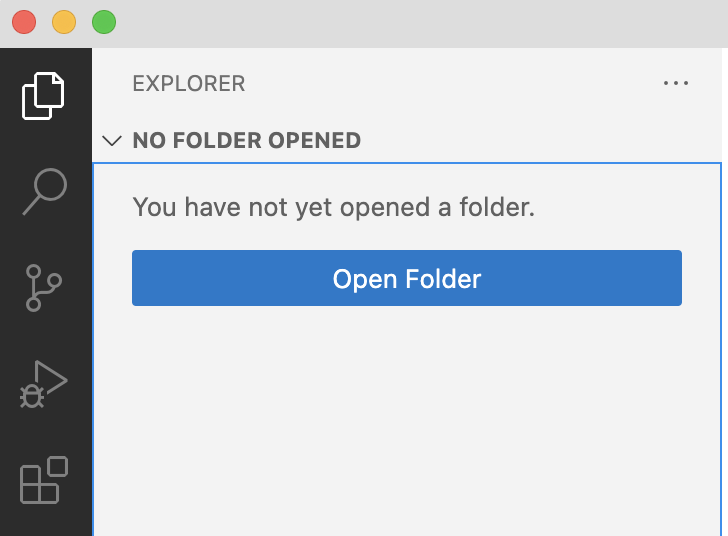

# Intro to Markup and Web Design

<!--
NOTES after SPRING 2025: This isn't working well. Too much talk, too little information. Need a new strategy.

1. Keep the Zen Garden opening, but openly introduce it as a showcase of design strategies, giving a justification for finding that menu. Then just click through to different designs without reference to your notes. ASK THE STUDENTS to identify carry-overs from the previous unit.

2. When you get up to the HTML source for that page, download it and open in a browser to show what it looks like to have no styling.

3. Use the inspector tools to add some basic, mobile-first styling:
    - padding on the body
    - max-width and center
    - change fonts everywhere
    - over-ride rules on headers / multiselect
    - border + 3px margin on divs
    - make nested divs a different color (descendant selector); use the color picker
THIS is how you show them what CSS does.

4. Before you leave the inspector, make sure you show them where to go to save it.

5a. Then send them to the CSS Diner, so they can learn about selectors? If so, point out that these are made-up HTML elements (XHTML) – but that for their own sites, they should use standard HTML5, which is why I'm assigning some tutorials.

5b. Show how headings structure the document, using a web accessibility tool?

5c. Have them use the inspector to modify the course site? The default Zen Garden stylesheet?

6. Start the tutorial.

-->

<section class="prereqs">
    

<strong>Texts to have read</strong>

        <ul>
            <li>The <a href="https://github.com/benmiller314/webs{{site.course.slugterm}}">website portfolio assignment</a></li>
        </ul>
    

    

<strong>Work to have achieved</strong>

        <ul>
            <li>Fork the assignment repo</li>
            <li>Write a website proposal and post it to the <a href="{{site.github.issues_url}}">issue queue</a></li>
        </ul>
    

</section>

**Plan for the day**:

1. Introduction to HTML markup and CSS style (30–40 min)
2. Brief tour of key text editor features (5–10 min)
3. Start the homework tutorial
4. EXT: Tour of unit resources
5. HW for next time

<aside>
    
A quick note about your proposals: First, I'm excited to see how many great ideas you have! If you haven't yet posted and want to talk to me, please email or come to office hours. And don't forget about those parachute prompt options...

    
Second: I want to warn you about the risks of scope creep. If you're still learning HTML and CSS, <em>you probably want to limit how much new material you need to actively research or compose.</em> Instead, <strong>plan around a minimum deliverable product</strong>, with stretch goals on top of that. For example, could you create a mockup with <a href="https://loremipsum.io/">Lorem Ipsum</a> (placeholder) text and images, and then work on replacing it if time allows? Could you try writing just one or two blog posts or location descriptions at first, but build space for where more will go?

</aside>

## 1. Introduction to markup and style

Can I once again get a couple of volunteers to [take notes](https://docs.google.com/document/d/1m1RqbKSqK77jTssbd3VESc3GhEjDf5WNpdLkVKZzZVU/edit?tab=t.0#heading=h.5dpgm2qxflva) / monitor anonymous questions today?

### Begin in the garden
Before we dive in deep, <strong>come with me to the <a href="http://www.csszengarden.com">CSS Zen Garden</a></strong>.

Some things to notice:

* Responsive design: the same page can change appearance to suit the "viewscreen" (especially as the width changes).

<!-- demo Verde Moderna (the default), -->

* The visual hierarchy holds here, too – including uses of containment and alignment to form groups, and negative space to establish rhythm.

<!-- Screen Filler, -->

* So, too, are we retaining the importance of color schemes for both coherence and contrast.

<!-- Mid-Century Modern -->

* Oh, and also? Every page you've just seen has _exactly_ the same underlying content: literally the same HTML file.

<!-- Even A Robot Named Jimmy. -->

### HTML vs CSS: separating content from display
How? The key is encoding the content separately from the presentation. And that's where our "web stack" begins: with HTML and CSS.

<table class="table table-bordered thead-light">
  <thead>
    <tr>
      <th>acronym</th>
      <th>stands for</th>
      <th>used for</th>
    </tr>
  </thead>
  <tbody>
    <tr>
      <td>HTML</td>
      <td>HyperText Markup Language</td>
      <td>content, groupings</td>
    </tr>
    <tr>
      <td>CSS</td>
      <td>Cascading Style Sheets</td>
      <td>display / presentation</td>
    </tr>
  </tbody>
</table>

In other words, per [the tutorial I'm assigning you for homework](https://www.internetingishard.netlify.app/html-and-css/introduction/#html-css-and-javascript),

<blockquote class="blockquote">
    <ul><li>HTML is for adding meaning to raw content by marking it up.</li><li>CSS is for formatting that marked up content.</li></ul>
</blockquote>

There are other languages that interact with these two, especially JavaScript, but also PHP and Python and Ruby: they can dynamically generate or change the HTML and CSS. There are also "preprocessor" languages that make it easier to write HTML and CSS in the first place by eliminating some repetition. You've already seen one of these: Markdown, the syntax you use in GitHub READMEs and forum posts, is essentially a shortcut form of HTML.

But even with all that complexity, it boils down to this: HTML and CSS are the core of what gets shown on the screen.

### HTML gives the document *structure*
Even if you've never used a formal markup language, you already use symbols to highlight one part of a text document and show that it's different from the rest. Let's take Markdown as an example:

* If you want to make something **bold**, you...
  - put `**asterisks**` on either side of it.
* If you want _italics_, you...
  - put `_underscore_` on either side (single asterisks will work, too).

The basic idea is that you need to signal where the <em>marked-up text</em> begins and ends.

The same is true in HTML, but it looks a little different:

<table class="table table-bordered thead-light">
  <thead>
    <tr>
      <th>what we’re marking</th>
      <th>Markdown syntax</th>
      <th>HTML syntax</th>
      <th title="By default. In practice, you can use CSS to change &lt;em&gt; to red text, or a different font, etc, instead of italics – and so on for any element.">What you get*</th>
    </tr>
  </thead>
  <tbody>
    <tr>
      <td>strong text</td>
      <td><code class="language-plaintext highlighter-rouge">**surrounding asterisks**</code></td>
      <td><code class="language-plaintext highlighter-rouge">&lt;strong&gt;opening and closing tags&lt;/strong&gt;</code></td>
      <td><strong>strong text</strong></td>
    </tr>
    <tr>
      <td>emphasized text</td>
      <td><code class="language-plaintext highlighter-rouge">_surrounding underscore_</code></td>
      <td><code class="language-plaintext highlighter-rouge">&lt;em&gt;opening and closing tags&lt;/em&gt;</code></td>
      <td><em>emphasized text</em></td>
    </tr>
  </tbody>
</table>

Unlike in Markdown, opening and closing tags in HTML aren't exactly the same. But they're <em>almost</em> the same: a <strong>closing tag</strong> in HTML just adds the slash after the first angle bracket.

You can think of them as being like <a href="https://xkcd.com/859/">parentheses</a>: In general, <strong>every HTML tag you open, you should close.</strong> (You can nest a complete pair of tags inside another pair (like these parentheses), but you can't close the outer pair before closing the inner pair – at least, not without causing problems.)

<!-- <aside class="alert alert-white">
Pro tip: Atom can automatically close the most recently opened tag. See Packages &gt; Bracket Matcher &gt; Close Current Tag, where you should also find a keyboard shortcut like <code>Cmd+Option+.</code>. (The shortcut's way more convenient, I find.) I like to use this also as a form of proofreading: it reassures me that any tags still open are what I expect is still open.</aside> -->

One nice thing about having the tags themselves marked by angle brackets is that you can add information to them, called <em>parameters</em>:

<table class="table table-bordered thead-light">
  <thead>
    <tr>
      <th scope="col">what we’re marking</th>
      <th scope="col">Markdown syntax</th>
      <th scope="col">HTML syntax</th>
      <th scope="col">what you get</th>
    </tr>
  </thead>
  <tbody>
    <tr>
      <td>a basic hyperlink</td>
      <td><code class="language-plaintext highlighter-rouge">[anchor text](http://destination)</code></td>
      <td><code class="language-plaintext highlighter-rouge">&lt;a href="http://destination"&gt;anchor text&lt;/a&gt;</code></td>
      <td><a href="http://destination">anchor text</a></td>
    </tr>
    <tr>
      <td>a hyperlink with special styling</td>
      <td><em>no default way to do it!</em></td>
      <td><code class="language-plaintext highlighter-rouge">&lt;a href="http://destination" class="alert-success"&gt;anchor text&lt;/a&gt;</code></td>
      <td><a href="http://destination" class="alert-success" title="a class on an HTML element lets you select that element for a CSS rule">anchor text</a></td>
    </tr>
  </tbody>
</table>

### HTML in practice

Armed with that information, you now know enough to go back to the [CSS Zen Garden](http://www.csszengarden.com/) and see how it's structured.

Right-click in any blank spot on the page, and choose **View Source** from the context menu that pops up.

Let's have a look!

A note about web browsers, especially Safari

    
NB: Chrome and Firefox have the best tools for web development, as we'll see. If you're using Safari, you won't see View Source by default. But you can <a href="https://developer.apple.com/library/archive/documentation/NetworkingInternetWeb/Conceptual/Web_Inspector_Tutorial/EnableWebInspector/EnableWebInspector.html">activate it under Safari &gt; Preferences &gt; Advanced</a>, down on the bottom: "Show Develop menu in menu bar."

    

Show me

        <figure>
            
            <figcaption>Safari's advanced preferences page</figcaption>
        </figure>
    

    
While you're there, you may want to tell the Smart Search Field to <a href="https://apple.stackexchange.com/questions/371473/always-show-full-url-in-safari-address-bar">show the full site address</a>, too. URLs often contain a lot more useful info than just the home page!

 <!-- end of browser support note -->

A few things to note in the Zen Garden source

<ul class="spaced">
<li><code>h1</code>, <code>h2</code>, and <code>h3</code> are headers, and establish <em>hierarchy</em>, and can be used to generate a page outline. You shouldn't skip levels.</li>
<li><code>p</code> is a paragraph.</li>
<li><code>a</code>, as we saw above, is an anchor for a hyperlink; it almost always has a <em>hypertext reference</em>, or <code>href</code>, as a parameter inside the opening tag.</li>
<li><code>div</code>s are like layer groups: they wrap around content that function as a unit.</li>
<li><code>section</code>s and <code>header</code>s and <code>footer</code>s are basically special <code>div</code>s!</li>
<li><code>class</code>es and <code>id</code>s are <em>labels</em> we can use to identify reusable content-types (classes) or unique locations (ids) within the document. They live as parameters inside opening tags.</li>
</ul>

### CSS in practice

**CSS works by _selecting_ labeled content** – HTML elements or classes, and sometimes other contextual cues – **and assigning _rules_** for how to display what's been selected.

These rules generally live in a _style sheet_ that's linked inside the `head` element of the HTML document.

To see this in action, let's look at [the stylesheet I'm using for this site]({{site.github_url}}/assets/css/screen.css)!

### You can play

You can View Source on literally any website -- though some are more complicated than others.

You can also Inspect a live website, using the same context menu (again, Safari users have this disabled by default), and see all the CSS rules currently being applied to any HTML element you want.

What's more, you can *change or add* CSS rules on the fly. (It'll stay as long as you don't refresh the page... though you can also copy the new rules before you leave.)

You'll want to come back to this when you're working on your own designs!

<!-- If that's too much, we could go back to the [codepen](https://codepen.io/benmiller314/pen/poJROZM), using the examples from the tutorial's Introduction and modifying from there. -->

## Text Editor orientation, then start the homework tutorial

For now, though, I suspect for many of you it'll be most useful to get your feet back on the ground. I'll be asking you to work through some more concrete tutorials for homework, building out a simple site from a shared design so you can get a feel for the steps before building your own.

Before you leave today, I want to make sure you're able to get up and running with your text editor and a browser, and seeing how they interact.

If you haven't yet done so, clone your forked repository onto your local computer, and open it up: GitHub Desktop should even give you the option to do so directly in your text editor of choice.

<figure>
</figure>

If at any time you need to open the files from VS Code directly, you can also open the explorer from the sidebar, and choose your root folder from there.

<figure>
</figure>

### Key code editing features that will make your life easier

<aside>
NB: If you're using another text editor, like Pulsar, rest assured that your editor can do these things, too! I'm mainly showing VS Code because, if anything, I find Pulsar a little more straightforward.
</aside>

**Let's confirm that you can...**

* Create new files and folders within the explorer (right-click on a blank space)

* Right-click in the explorer to Reveal a file in Finder/Explorer. From there, you can double-click to open an html file in your browser.

* Split Left / Split Right (right-click any filename)
  - View your HTML and CSS files at the same time! Or any two files. Or three, or six if you want to split top/bottom, too. It's the best.

### Okay, go ahead and start the tutorial!

    
Excitingly, the website for <a href="https://internetingishard.netlify.app/html-and-css/">my up-til-now favorite tutorial</a> is having some pretty major issues (at least intermittently)! <strong>But</strong> my still-favorite CSS YouTuber, Kevin Powell, very recently launched <a href="https://learn.kevinpowell.co/course/html-css-for-absolute-beginners">an introductory tutorial of his own.</a> <strong>So</strong> I spent a bunch of time yesterday swapping out the tutorial assignments I'd had planned with these new ones.

    
Please bear with me if the timings aren't quite as worked-out: in fact, if you can keep me up to date with how long you're spending on homework this unit, that will help me fine-tune the assignments in response.

Get through as much as you can of...
- The quick [introduction to the course](https://learn.kevinpowell.co/course/html-css-for-absolute-beginners/1-introduction/1-welcome-to-the-course)
- [Module 2, on HTML](https://learn.kevinpowell.co/course/html-css-for-absolute-beginners/2-html/1-the-languages-that-make-up-the-web), which hopefully repeats and clarifies some of what we discussed today, before extending it
- [Module 3, on CSS](https://learn.kevinpowell.co/course/html-css-for-absolute-beginners/3-css/1-what-is-css)

**Show your work** by building out the model website he guides you through, _pushing your tutorial code to the tutorials folder of your project repository_. (Note, though, that the subfolders there referred to the old tutorial, so you'll want to replace them with the folders recommended in the new tutorial.)

As Powell explains in the introduction, you can for the most part either read or view the videos – they mostly repeat each other at varying degrees of detail. Some people will find the videos easier to follow, others will find the text easier to search through as a reference. Do whichever you find clearest, or a combination!

I'll float around and help.

## EXT: Web unit resources

If possible, please at least skim through the assets and advice I've compiled so far on [the course site's resources page]({{site.github.url}}/resources).

If you're already experienced at web design and/or you find yourself breezing through the assigned tutorial, you can find other self-paced learning opportunities here.

<strong>Of particular note: Text editor extensions </strong>
   
NB: If there's something you expect VSCode or Pulsar to do, but it doesn't, chances are someone's already coded an Extension to make the program do it.

  

  

  To search for, install, or otherwise manage extensions, <strong>in VS Code, go to View > Extensions</strong> or click on the icon that looks like building blocks. You can search from the top bar. <strong>In Pulsar, use Packages > Open Package Manager > + Install</strong>.
  

  
Some extensions I expect you'll find useful:

  <ul>
        <li>
          
<a href="https://marketplace.visualstudio.com/items?itemName=Compulim.compulim-vscode-closetag">Close HTML/XML tag</a>, by Compulim: adds a keyboard shortcut to automatically detect the last-opened html tag, and close it. Useful for proofreading!

        </li>
        <li>
          
<a href="https://marketplace.visualstudio.com/items?itemName=formulahendry.auto-rename-tag">Auto Rename Tag</a>, by Jun Han. If you change an <code class="language-plaintext highlighter-rouge">h2</code> to an <code class="language-plaintext highlighter-rouge">h3</code>, this will automatically update the corresponding closing or opening tag so you don’t end up with a mismatch.

        </li>
        <li>
          
<a href="https://marketplace.visualstudio.com/items?itemName=pranaygp.vscode-css-peek">CSS Peek</a>, by Pranay Prakash. Detects definitions for CSS <code class="language-plaintext highlighter-rouge">id</code>s and <code class="language-plaintext highlighter-rouge">class</code>es from inside your HTML files, by looking in linked stylesheets.

        </li>
        <li>
          
<a href="https://marketplace.visualstudio.com/items?itemName=Zignd.html-css-class-completion">Intellisense for CSS Class Names in HTML</a>, by Zignd. Offers autocomplete for CSS <code class="language-plaintext highlighter-rouge">class</code> names from linked stylesheets while you’re working in HTML.

        </li>
        <li>
          
<a href="https://marketplace.visualstudio.com/items?itemName=george-alisson.html-preview-vscode">HTML Preview</a>, by George Oliveira (note that the more-frequently downloaded one, by Thomas Haakon Townsend, is no longer being maintained). Lets you see a preview of your HTML file without having to head to the browser (though you may still want to, for inspector reasons!)

        </li>
        <li><a href="https://marketplace.visualstudio.com/items?itemName=formulahendry.auto-close-tag">Auto-Close Tag</a>, by Jun Han. Every time you open a new HTML tag, the corresponding closing tag will be generated automatically. A lot of people love this, but I find it annoying; your mileage may vary.</li>
      </ul>

  
Read the README inside any installed package for tips on how to use it. This will open just like any other file, so you can move it, split it, etc.

## Homework for Next Time

* **Sign up** for Kevin Powell's [HTML & CSS for absolute beginners](https://learn.kevinpowell.co/course/html-css-for-absolute-beginners). It requires a free login, but that's mainly to help save your progress; you shouldn't get any spam emails.
    - If you're unable to log in, even at home (though I'm hopeful the delay will help), you can also work through the old tutorial at [Interneting is Hard (but it doesn't have to be)](https://internetingishard.netlify.app/html-and-css/). Work through *up through "Hello, CSS"*
        - If you're zooming through: "float" layouts used to be a big deal, but aren't recommended any more: modern techniques like grid and flex are more flexible, and easier to get right. So please _skip that chapter_ and instead skip ahead to read about Web Typography and Semantic HTML. The [Resources](../resources) page also has links to some resources on Grid layout that will serve you better and that won't be covered in the old tutorial.
* **Work through** the first three modules. Note that you should be able to *either* read the text *or* watch the videos: they mostly repeat each other's content. Use whichever suits your preferences!
    - The quick [introduction to the course](https://learn.kevinpowell.co/course/html-css-for-absolute-beginners/1-introduction/1-welcome-to-the-course)
    - [Module 2, on HTML](https://learn.kevinpowell.co/course/html-css-for-absolute-beginners/2-html/1-the-languages-that-make-up-the-web)
    - [Module 3, on CSS](https://learn.kevinpowell.co/course/html-css-for-absolute-beginners/3-css/1-what-is-css)
* **Show your work** by building out the model website he guides you through, _pushing your tutorial code to the tutorials folder of your project repository_.
    - Note that the subfolders there referred to the old tutorial, so you'll want to replace them with the folders recommended in the new tutorial.
    - If your local pages are not working the same as in the tutorial videos, please do check with me! I'll set aside some breakout group time next class, but feel free to email or use the [issue queue]({{site.github.issues_url}}) in the meantime: see if your question's been answered, and if not, [post a new issue]({{site.github.issues_url}}/new/choose), because you're probably not alone.
