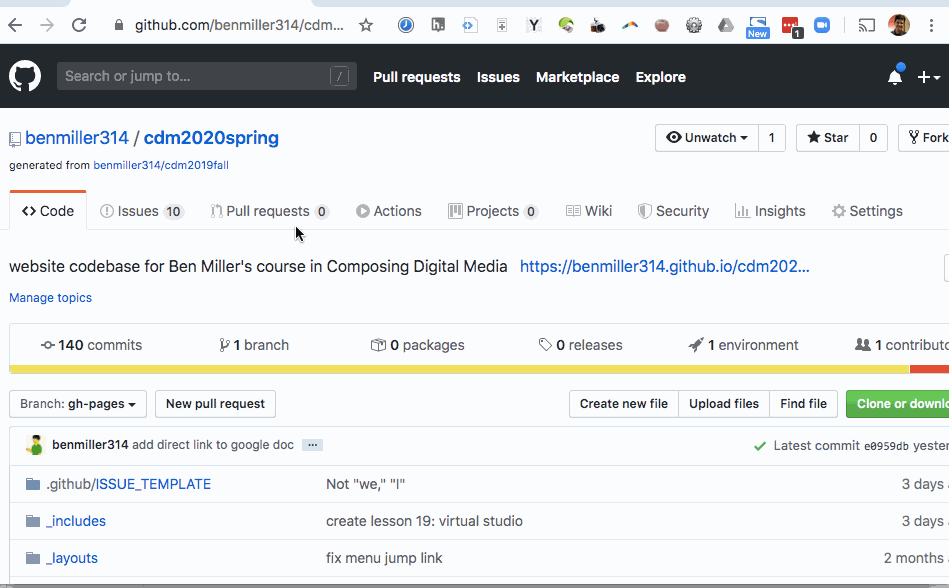
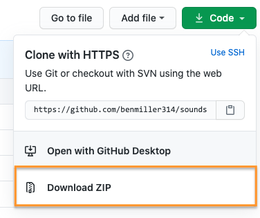

# Web Unit Workshop

<section class="prereqs">
    

<strong>Texts to have read</strong>

        <ul>
            <li>Any remaining tutorials from the <a href="../schedule">scheduled assignments</a></li>
            <li>Any tutorials or documentation you find on your own to help you achieve your design vision</li>
        </ul>
    

    

<strong>Work to have achieved</strong>

        <ul>
            <li>a solid attempt at a complete website portfolio, ideally meeting <a href="https://github.com/benmiller314/webs{{site.course.slugterm}}?tab=readme-ov-file#generative-constraints">baseline criteria</a>. Rough edges are still welcome.</li>
        </ul>
    

</section>

    
Please make sure your files are all committed and pushed to GitHub, and indicate at the top of your README file where to find your landing page! In absence of reasons not to, go with <strong>~/docs/index.html</strong>.

<!-- 
 -->

Relatedly, if you're using Jekyll or React or something like it, please give instructions on how to load your most current rendered website, e.g. a link to the published GitHub Pages site. In that case, partners, you may want to View Source on the final rendered page.

<!-- 
 -->

**Plan for the day**:

1. Update the workshop cycle for our unit (3 times 15-20 min)
  - Describe what you see in the HTML, then in the browser
  - Evaluate using our shared criteria
  - Suggest ways to level up
  - Post comments on the latest commit
2. Identify your partners
3. Work through the cycle (and reflect)
4. EXT homework: forum on consolidation unit

## 1. Update the workshop cycle for this unit

Like the last two times, I'd like you to use a workflow that, first and foremost, *helps you see what's already happening.*  

It takes practice! Please do try: it helps make your comments more concrete and actionable, for both your partner and yourself. It's great to like something, but _if you can't say **what** you liked, the creator can't build on that knowledge as effectively... and **you** may not be learning as much as you could by naming what you value._

**A good test is whether you can tell, just from reading your comment, what you were reacting to.**

<!-- 
Note for async workshop: You may want to time yourself. In class we wouldn't have more than 15-20 minutes for each of three partners.

 -->

### 1a. Describe what you see
Begin by saying back what's there, so your partner knows whether their intentions are being understood. NB: For this unit, in which display is a separate – and often challenging – concern, I'm going to ask you to use a <em>two-step description</em>:

* **First look at the HTML, and say back what you see there.** What seem to be the major content areas? What's given top-level focus? (e.g. what kind of things are getting their own pages, or what's at `<h1>` status within a page?) What's next in the hierarchy?
* Once you've done that, **turn to the browser and repeat the process for the display.** What's given visual weight? What falls "above the fold"? Where are you invited to go next?

### 1b. Evaluate using our shared criteria

Review the [baseline criteria and aspirational goals](http://bit.ly/cdm{{site.course.slugterm}}-notes) we set last week, which I'll paste below for convenience.

* Is your partner's draft meeting baseline criteria? If not, where not?
* Where is your partner's draft going beyond baseline? Is the draft already meeting any particular aspirations?
* Does the hierarchy of the display correspond to the hierarchy implied by the HTML? If not, describe where they differ.

NB: This is still a form of description, not a judgment of anyone's ability. We're all still learning here!

Baseline

For a minimum grade of B, all projects for this unit must…
<ul><li>Use arrangement, size, color, visual rhythm, and/or contrast to focus viewers' attention.</li>
<li>Include at least 3 navigable html locations (separate pages or distinct scrolling locations on the same page)</li>
<li>Include a sitewide CSS stylesheet (i.e. an organized visual theme)</li>
<li>Link internally from all pages (no dead ends)</li>
<li>Include at least one legally useable image, <em>with alt text</em></li>
<li>Credit all assets correctly on the site itself (or link to credits in the repo), including Title, Author, Source, and License</li>
<li>Successfully load all elements in a web browser, at least locally (i.e. file paths should work on any computer)</li>
<li>Use meaningful commit messages that say what’s changing (or even why)</li>
</ul>

Aspirational

    
To target (but not guarantee) a grade above a B, the best projects for this unit may do some (but probably not all!) of the following:

    <ul>
        <li><em>Dynamism</em>
            <ul>
                <li>Use responsive design (e.g. <code>@media</code> queries, <code>flex-wrap</code>, <code>auto-fill</code>, etc) to dynamically resize elements based on viewport width</li>
                <li>Animate HTML elements via CSS or JavaScript (e.g. image carousel, <code>@keyframes</code>, <code>:hover</code> / <code>:focus</code> events, etc)</li>
                <li>Swap in/out content via JavaScript (e.g. on-click events / functions)</li>
                <li>Use JavaScript file to help construct the web page (e.g. dynamically load images from a folder)</li>
            </ul>
        </li>
        <li><em>Coding</em>
            <ul>
                <li><a href="https://validator.w3.org/">Validate</a> your HTML</li>
                <li>Use Flexbox or Grid layouts</li>
                <li>Use classes shared across multiple elements to minimze repetition in your CSS</li>
                <li>Use <a href="https://benmiller314.github.io/cdm2022spring/resources#web-frameworks:~:text=a%20tool%20for%20incorporating%20templates%20and%20variables">Jekyll</a> to minimize repetition in your HTML through templates and variables</li>
                <li>Use CSS preprocessors (e.g. SASS, LESS) or <a href="https://css-tricks.com/a-complete-guide-to-custom-properties/">custom properties</a> to minimize repetition in your stylesheets</li>
                <li>Add comments, whitespace, and other formatting to code to make it more readable</li>
            </ul>
        </li>
        <li><em>Audience Engagement</em>
            <ul>
                <li>Use non-default fonts, drawing on visual unit knowledge</li>
                <li>Use best practices for accessible design (see <a href="https://www.w3.org/TR/UNDERSTANDING-WCAG20/intro.html#introduction-fourprincs-head">W3's Four Principles</a> and the <a href="http://wave.webaim.org/">WAVE web accessibility evaluation tool</a>)<ul><li>These include, but are not limited to, using semantic HTML elements like <code>&lt;section&gt;</code> and <code>&lt;nav&gt;</code> instead of <code>&lt;div&gt;</code></li></ul></li>
                <li>Use breadcrumbs or other cues (e.g. sticky / static nav) to help readers locate themselves within the site, no matter where they begin</li>
                <li>Optimize image filetypes, resolutions, and file sizes for faster loading</li>
                <li>Load site publicly over the internet (e.g. with GitHub Pages)</li>
            </ul>
        </li>
        <li><em>Reflection</em> (not due yet!)
            <ul>
                <li>Make a clear argument in your reflection as to why you met enough of the aspirational criteria to be stretching the abilities you came in with: e.g. clarify what skills you came in with, and what was new</li>
                <li>Justify the website's structure for its intended purpose / audience</li>
                <li>(For all of the above, clarify your compositional choices and goals (e.g. design hierarchy)</li>
                <li>Refer to specific tutorials or reference materials that helped you in your design</li>
                <li>Discuss what you would do if you had more time, and why you didn't have time now</li>
            </ul>
        </li>
    </ul>

### 1c. Suggest ways to level up

* Is the draft _almost_ meeting any particular aspirational goals? Which would you suggest trying next?
* Any other ways to improve that you can suggest, based on the readings and advice we've discussed in this class?
* If there was a mismatch between the hierarchies in the presentation and the content, which of these would you suggest changing, given what you think the intention was? (Commit messages may be helpful in figuring this out, if you have time.)

### 1d. Post comments on the latest commit
Finally, make sure you **post** all these comments – in respectful language you'd be comfortable sharing publicly – on the latest commit on the project's GitHub website.

As a reminder, here's how and where to leave / find comments on GitHub.

Just...
    <ol>
        <li>click through to the history of commits (the clock button);</li>
        <li>click on the _commit hash_, the set of random-seeming numbers and letters almost at the end of the top row (i.e., for the most recent commit); and</li>
        <li>scroll to the bottom of the _diff view_ that appears. You'll see a comment box there: <figure role="figure"></figure></li>
    </ol>

## 2. Identify your partners
As usual, you'll want to click through to the next three people in your row, wrapping around when you hit the end.

<!-- group bullets go here -->
* <a href='https://github.com/JoshKrym/webs2025spring'>Josh</a>, <a href='https://github.com/gavin-abramowitz/webs2025spring'>Gavin</a>, <a href='https://github.com/davidaltman920/webs2025spring'>David</a>, <a href='https://github.com/wex59/webs2025spring'>Weini</a>
* <a href='https://github.com/DAB367/webs2025spring'>Dana</a>, <a href='https://github.com/mschnelk/webs2025spring'>Mia</a>, <a href='https://github.com/2004Moonlove/webs2025spring'>Yang</a>, <a href='https://github.com/wills-projects/webs2025spring'>Will L</a>, <a href='https://github.com/morganfilar/webs2025spring'>Morgan</a>
* <a href='https://github.com/raeganbest/webs2025spring'>Raegan B</a>, <a href='https://github.com/reagan-h6/webs2025spring'>Reagan H</a>, <a href='https://github.com/mconley25/webs2025spring'>Maddie</a>, <a href='https://github.com/Cferzoco/webs2025spring'>Carla</a>, <a href='https://github.com/daminidwivedi/webs2025spring'>Damini</a>
* <a href='https://github.com/WLD10/webs2025spring'>Billy</a>, <a href='https://github.com/erinkelly25/webs2025spring'>Erin</a>, <a href='https://github.com/hanbos09/webs2025spring'>Hannah</a>, <a href='https://github.com/longworthgrace23/webs2025spring'>Grace</a>, <a href='https://github.com/src141/webs2025spring'>Shreya</a>

Go ahead and click through to first your partner's repo, and either clone or **download the zip file** by clicking on the green  button. The latter will be a faster download than cloning, with just the latest snapshot. (But if you want to see revision history, the zip means you'd have to do it on the web.)

Show me

<figure role="figure"></figure>

What to do if your partner's draft is missing

    <ul>
        <li>If one of your partners hasn't turned in a draft, first check with them to see if they need help getting their files onto GitHub.</li>
        <li>If they're not yet ready to post, skip to the next person in your row.</li>
        <li>If by skipping you've wrapped all the way around, BUT you've left at least one comment, you can reclaim the rest of the time for studio.</li>
        <li>If you've wrapped all the way around and still don't have even a single a draft to respond to, jump down to the next row so you can give at least one comment today. It's to your benefit, too! Look for someone who's absent, and write one of the reviews they were assigned.</li>
    </ul>

## 3. Work through the cycle (and reflect)
Repeat the steps above for **three partners**. On subsequent loops, note that *after* viewing the project first, you may also want to read and/or refer to the previous comments.

But this is not just a way of ensuring that you get feedback from three partners; **workshop is also a way of training your eyes, and of realizing new possibilities.** As we head into Thursday's studio class, think about what you've seen that _you'd_ like to try. What suggestions would you give yourself, now that you've given suggestions to others?

<!--

I said above that even late peer reviews are due ideally by Thursday morning; even if that's not possible, please be sure to have them completed no later than Thursday at 12:45pm, so your partners have them for in-class studio.

 -->

## EXT / Homework: Thinking ahead
* Continue to **save, commit, and push** toward your project, incorporating feedback from partners.
    - If you didn't get feedback from three partners, please **let me know** asap! I'll prioritize you for my own feedback.
    - Likewise, if you haven't finished _giving_ feedback, please do so asap, and no later than noon on Wednesday for full credit.
* **Next class will be a web designers' studio**: bring whatever you need to work towards finalizing your website portfolio, including headphones if you prefer sonic isolation while you work.
    - The final-for-now draft is targeted for end-of-day on Sunday, with a reflection due by noon on Monday; see the [assignment prompt](https://github.com/benmiller314/webs{{site.course.slugterm}}#deadlines-and-products) for further details.
    - This will let us preserve the last few weeks of class for consolidation / integration, which might look like continued revision of any project so far, or (if you're happy with your earlier products) one more quick project cycle, possibly in collaboration with partners.
* Toward that latter end, as I did at the same point in the audio and visual units, I'm inviting you to think forward into the final unit: what further possibilities of digital composition might you want to explore? How might your earlier projects fit into a larger context or series? See <a href="{{site.github.issues_url}}">the issue queue</a> for more details.
    * There is no minimum length for this post, but this is a good time to start gears turning about potential collaborations...
