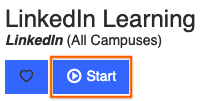

# Resources

This set of resources will likely expand as we move forward; <strong>feel free to suggest others that you come across!</strong> (You can fork the repo, <a href="{{site.github.repository_url}}/blob/gh-pages/{{page.path}}">edit this page</a>, and file a pull request! Or just email me. That works, too.)

NB: Searching on your own is also good! It's how I find these things, after all. But note that a Large Language Model like ChatGPT is not, in itself, a search; it's attempting to recreate language it's found elsewhere. Same goes for Google's AI Overview, actually! <em>Look for the sources</em> so you can see more clearly how to adapt advice from their context to your own.

## Table of contents {#resources-toc}
<nav aria-labelledby="resources-toc">
    <ul>
      <li><a href="#services-at-pitt">Services at Pitt</a></li>
      <li><a href="#hardware-and-software">Hardware and Software Expectations</a></li>
      <li><a href="#help-with-git-and-github">Help with Git and GitHub</a></li>
      <li><a href="#assets">Free and Licensed Images, Sounds, and Other Assets</a>
        <ul>
          <li><a href="#sounds-and-music">Sounds and Music</a></li>
          <li><a href="#visuals">Visuals</a></li>
          <li><a href="#web-frameworks-and-libraries">Web Frameworks</a></li>
        </ul>
      </li>
      <li><a href="#advice-and-examples">Advice and Examples</a>
        <ul>
          <li><a href="#audio-editing--soundwriting">Audio Editing / Soundwriting</a></li>
          <li><a href="#visual">Visual Rhetoric and Design</a></li>
          <li><a href="#web-design">Web Design</a>
     <!-- - [Interactive Narrative](#twine--interactive-narrative) --></li>
        </ul>
      </li>
      <li><a href="#file-compression">File Compression</a></li>
      <li><a href="#other-resource-roundups">Other Resource Roundups</a></li>
    </ul>
</nav>

## Services at Pitt
<dl>
<dt><a href="https://pitt.libguides.com/assistanceresources/home">Pitt and Community Assistance Resources</a></dt>
<dd>This annotated list of links is not specific to digital media, but rather addresses the underlying supports you need to learn: things like food, clothing, housing, and health. If you find yourself struggling to obtain or maintain your basic needs, there are resources to help you! 
<strong>In a crisis situation,</strong>&nbsp;at any time of the day or night, you can reach a trained professional through the&nbsp;<a href="https://www.studentaffairs.pitt.edu/cc/crisisemergency/" target="_blank">University Counseling Center’s</a>&nbsp;24/7 hotline (412-648-7930 ) or through the&nbsp;<a href="https://www.upmc.com/services/behavioral-health/resolve-crisis-services" target="_blank">resolve Crisis Services</a>&nbsp;(1-888-796-8226).
</dd>

<dt><a href="https://pitt.libguides.com/equipment">Hillman Library Media Equipment Lending Program</a></dt>
<dd>Did you know you can borrow high-quality microphones from the library? It's true! They also have video equipment (though less relevant for our class, sorry again) and tutorials on how to use it all. While we're talking Hillman, it's also worth noting that they have a <a href="https://library.pitt.edu/whisper-room">sound-isolated recording space</a> (the Whisper Room). If you're having trouble with background noise, it could be worth making a reservation!</dd>

<dt><a href="http://writingcenter.pitt.edu/">Pitt Writing Center</a></dt>
<dd>Though not every consultant will have experience in multimodal composing or digital media, some will; but more importantly, the Writing Center's emphases on process-oriented reflection and rhetorical thinking makes every consultant a useful sounding board for developing ideas, getting feedback from an outside reader, and getting organized for revision and reflection. It's a good idea to <a href="http://writingcenter.pitt.edu/undergraduate-services">plan for your visit</a> and to make an appointment before you go.</dd>
<!--
<dt><a href="http://dmap.pitt.edu/">DMAP site</a></dt>
<dd>The English department maintains a Digital Media And Pedagogy site with a number of useful resources, including <a href="http://dmap.pitt.edu/equipment">recording equipment</a> you can check out, easy-to-reserve office hours with either a grad student or faculty digital media consultant (see the sidebar), and a way to reserve the DMAP studio (CL 463) for up to eight people.</dd> -->

<dt><a href="https://www.diversity.pitt.edu/disability-resources-services/disability-resources-services">Disability Resources</a></dt>
<dd>If you have a disability for which you are or may be requesting an accommodation, you are encouraged to contact both your instructor and the Office of Disability Resources and Services, 140 William Pitt Union, 412-648-7890 / 412-624-3346 (Fax), as early as possible in the term. Disability Resources and Services will verify your disability and determine reasonable accommodations for this course.</dd>

<dt><a href="http://www.studentaffairs.pitt.edu/cc/">Counseling Services</a></dt>
<dd>Pitt also offers free counseling for students who are experiencing personal or emotional difficulties. The Counseling Center, located on the 2nd Floor Nordenberg Hall, offers Psychological Services and Sexual Assault Services (412-648-7930) (8:30 am-5:00 pm, Monday-Friday) or (412-648-7856) (after 5 pm, Monday-Friday or on weekends).</dd>

<dt><a href="https://upstreetpgh.org/">UpStreet mental health services</a></dt>
<dd>Not actually a Pitt service, but a Pittsburgh one, and still potentially good to know about: UpStreet offers free, no-appointment-needed counseling with licensed mental health professionals via webchat -- and it's designed for people aged 12-22. They also have free readings on coping with stress and other wellness topics; conversely, they also offer paid appointments for more extensive one-on-one therapy. </dd>

</dl>

*[Back to table of contents](#resources-toc)*

## Hardware and Software Expectations {#hardware-and-software}

All of the software for this class is designed to be cross-platform, but that usually means it’s been developed and tested for Mac and Windows operating systems, and often Linux as well. It is not guaranteed that it will work for ChromeOS or iOS, so _if your primary device is a tablet, you may need to complete most of your work on lab computers or through web interfaces_, which are not always as fully featured.

If you’re worried about file storage, I highly recommend (but don’t require) getting an **external hard drive**, which is also a great solution for regularly backing up your most important files more generally.

Beyond your computer, you may need to make original sound recordings and/or take original photographs; a **cell phone of recent vintage** should be enough, or you can borrow equipment from Pitt.

In addition, you’re going to want **headphones**, pretty often: our first unit deals with sound, and beyond that, you might well want some sonic isolation even in non-aural units.

### Required Software

You are responsible for downloading and installing the following software packages, all of which cost zero dollars:

* [Git](https://git-scm.com/). Version control software for the command line.
    - I’m going to highly recommend the GUIs (graphical user interfaces) available for both Mac and Windows: go to [https://desktop.github.com/](https://desktop.github.com/).
    - If you prefer the command line, Mac users may wish to install git via Homebrew(https://brew.sh/); Windows users may wish to install [GitBash](https://gitforwindows.org/).
* Audacity (https://www.audacityteam.org/). Audio editing toolkit.
    - In addition to the main application, you may want the ffmpeg plugin to import and export in a wider variety of file formats. Look for separate download instructions on the page where you download Audacity.
* GIMP (https://www.gimp.org/). The GNU Image Manipulation Program.
    - If you strongly prefer Photoshop (which is not free, but which Pitt tuition does license), talk to me; I’ll probably allow it, but may also ask for a rationale / feature comparison.
* Visual Studio Code (https://code.visualstudio.com/) or Pulsar Editor (https://pulsar-edit.dev/). A cross-platform plain-text editor, with syntax highlighting and other features to support programming.
    - Alternatives like Notepad++ (for Windows) and TextWrangler (for Mac) are acceptable, but you cannot use something like Microsoft Word for this.
* A full-featured open-source web browser, such as [Chrome](https://www.google.com/chrome/dr/download) or [Firefox](https://www.mozilla.org/en-US/firefox), will serve you best in the web unit for inspecting design elements while on the page. Safari and Edge can do it, but not quite as well; and Internet Explorer just isn’t all there.

I recommend downloading these at your earliest convenience.

*[Back to table of contents](#resources-toc)*

## Help with Git and GitHub
<dl>
<dt><a href="https://education.github.com/discount_requests/new">Get free private repositories</a></dt>
<dd>Important for starting out: GitHub defaults to making repositories public, and ordinarily you would have to buy a paid account to keep your projects private. But if you have a .edu email account, you can request a discount that lets you get unlimited private repositories for free. Click the link to find out more.</dd>

<dt><a href="https://www.youtube.com/watch?v=BCQHnlnPusY&list=PLRqwX-V7Uu6ZF9C0YMKuns9sLDzK6zoiV">Git and GitHub for Poets</a></dt>
<dd>A delightfully nerdy, yet strangely accessible, playlist of tutorial videos on using GitHub and Git (in that order) to keep track of changes to a text file. A great way to learn more about the features that make these tools appealing to coders and non-coders alike.</dd>

<dt><a href="https://docs.github.com/en/desktop/overview/getting-started-with-github-desktop">Getting Started with GitHub Desktop</a></dt>
<dd>The official documentation for using the GH Desktop application, a GUI (graphical user interface) that gives you more flexibility than the GitHub website, but also a more user-friendly appearance (including next-step-in-the-workflow suggestions) than command-line git. See especially the section about <a href="https://docs.github.com/en/desktop/making-changes-in-a-branch/managing-branches-in-github-desktop">making changes in a branch</a>.</dd>

<dt>What to do if your files are too large for GitHub</dt>
<dd>
If you get an error message telling you that you can't push to GitHub because your files are too large, try <a href="https://git-lfs.github.com/">Git Large File Storage</a> (git-lfs): it stores large files on a separate server, and converts the file in your GH repo into a tiny pointer file. The <a href="https://docs.github.com/en/free-pro-team@latest/github/managing-large-files/versioning-large-files">documentation</a> is pretty clear, though it does involve a little command-line fu at times. (Nothing major: you can just follow the steps.) And when it's all set up, it works in GitHub Desktop pretty seamlessly.

The one catch is that if you're using git-lfs on a forked repo, the extra storage you get counts against the quota of the <em>upstream</em> fork, so if everyone uses it for CDM assignments, eventually I run out of data and *nothing* can be pushed. So at the end of the semester, I'll ask you to re-clone your repo and add a new remote branch that's not on my fork tree. But we'll cross that bridge if/when we come to it!

Oh! And if you discover that you have large files you can't push after they're already in your commit history, you'll need to start managing *those* large files with git-lfs, too. Luckily there's now [a (simple command line) tool to help you do that](https://github.blog/2017-06-27-git-lfs-2-2-0-released/)!

If all else fails, fear not! You can always (1) start an empty new repository on GitHub, (2) point your local repository to that new one by <a href="https://docs.github.com/en/github/using-git/changing-a-remotes-url">changing the remote URL at the command line</a>, and (3) pushing your now-correctly-configured files to the new repository. The new repo should now inherit the entire history of your local one, including all your messages. Just be sure to (4) add a link to the new repository in the README.md file of your old one, so we can find it easily.

</dd>

<dt><a href="https://education.github.com/git-cheat-sheet-education.pdf">Git Cheat Sheet</a></dt>
<dd>Two pages containing everything you need to know for everyday version-tracking, from how to set up your local repository to how to recover past versions, with your normal status->add->commit->push-> workflow prominently placed. This is all for the command line; if that makes you uncomfortable, you might enjoy this somewhat irreverent <a href="https://learning.oreilly.com/library/view/learn-python-the/9780133124316/app03.html">Command Line Crash Course</a>. Or, you know, just go with the GitHub Desktop GUI.</dd>

<dt><a href="http://ohshitgit.com/">ohshitgit.com</a></dt>
<dt><a href="https://dangitgit.com/">dangitgit.com</a></dt>
<dd>These are the same site; the second is just, ah, cleaned up a bit. The frustration, though, is the same, because let's face it: there are times when even experienced users of git feel that something has gone terribly wrong. This is a great resource of quick command-line fixes for common problems, compiled by someone who feels your pain.</dd>

<dt><a href="https://lab.github.com/paths">GitHub Learning Lab</a></dt>
<dd>Should you feel enticed by our course to want to go deeper into the capabilities of GH and go with the GitHub Flow, come here: it's a system of tutorials built directly into the GitHub web interface, with a "robot" that gives you prompts and affirmations of success right in the Issue Queues and Revision Histories of your own repositories. (Each new "course" you take in the Learning Lab will auto-generate a new repository to play with.) To enable this magic of automation work, you'll have to give the app some major permissions on your account – but since it's written by the same people who make GitHub, I felt pretty comfortable trusting them anyway. (They already keep all my stuff, you know?)</dd>

</dl>

*[Back to table of contents](#resources-toc)*

## Free and Licensed Images, Sounds, and Other Assets {#assets}
In this section:
- [Sounds and Music](#sounds-and-music)
- [Visuals](#visuals)
- [Web Frameworks](#web-frameworks-and-libraries)

<dl>
<dt><a href="https://search.creativecommons.org">search.creativecommons.org</a></dt>
<dd>A portal for searching multiple sites that have built-in CC licensing, including flickr, jamendo, and ccmixter</dd>
</dl>

### Sounds and Music
<dl>
<dt><a href="https://freesound.org">Freesound</a></dt>
<dd>As they put it in their <a href="https://freesound.org/help/faq">FAQ</a>, "Freesound aims to create a huge collaborative database of audio snippets, samples, recordings, bleeps, ... released under Creative Commons licenses that allow their reuse." Note that this won't have <em>music</em> as such; it's more for incidentals.</dd>

<dt><a href="http://dig.ccmixter.org/">CCMixter</a></dt>
<dt><a href="https://soundcloud.com/">SoundCloud</a></dt>
<dt><a href="https://www.jamendo.com">Jamendo</a></dt>
<dt><a href="https://freemusicarchive.org/">Free Music Archive</a></dt>
<dd>Sites where you can find music with open licenses for remix. Each has its own community and search interface; I've had some success using CCMixter's tag search feature. Pay attention to the licenses for the specific tracks you want: some have the non-commercial Creative Commons license, and <em>some are licensed only to listen to</em>, especially on SoundCloud, where a lot of professional recording artists post to build buzz. If you're planning on doing any cutting or distorting, look for something you can modify (which includes CC-BY or CC-BY-NC).</dd>

<dt><a href="https://www.youtube.com/audiolibrary/">YouTube Audio Library</a></dt>
<dd>This could easily be folded in with the list above, but I want to keep it separate for a few reasons: (1) I'm adding it later, so I want to make its newness more visible; (2) because it requires a login to use (but Google login works fine); and (3) because it's got a really excellent interface! There's an impressive set of filters, including genre, mood, and duration; single click to download; and if there's a CC license, it'll give you the permalinks and citation right there for ease of copy-paste. Also has sound effects on a separate tab.
</dd>

<dt><a href="https://github.com/mattingalls/Soundflower">Soundflower</a></dt>
<dt><a href="https://github.com/ExistentialAudio/BlackHole">BlackHole</a></dt>
<dd>
These aren't repositories of sounds, but rather another way to get sound: they're MacOS system extensions that allow you to <strong>record directly from any app into Audacity</strong> by piping sound output/input through a new "channel" which you can select as Audacity's input device. (I suspect something similar is available for PCs but I'm not sure yet what it is. <a href="{{site.repo_url}}/issues/new/choose">Let me know</a> if you find it!) Soundflower works for Macs up through MacOS Catalina; for more recent devices that use an M1 chip, you'll want to use BlackHole. Once installed, you just set your computer's "speaker" to the new channel (as if you were selecting headphones) and set Audacity's input to the same. (And don't forget to change them back after you've made the recording...)

Whatever source you're recording from, be sure that you have permission to do so, either from an explicit license, from public domain, or from fair use. As always, make a note of these permissions as you're making the recording, so you don't lose track!

NB: the easiest way to install either extension is via the command-line tool <a href="https://brew.sh/">Homebrew</a>; see that linked page for more about Homebrew, and see the project's GitHub repositories for the appropriate brew command. 
</dd>

</dl>

*[Back to main table of contents](#resources-toc)* |
*[Back to assets table of contents](#assets)*

### Visuals
<dl>
<dt><a href="https://unsplash.com/">Unsplash</a></dt>
<dd>A collection of high-res, large-scale images that are free for personal <em>and</em> commercial uses; they may be especially useful for splashy website headers and homescreens.</dd>

<dt><a href="https://undraw.co/">Undraw</a></dt>
<dd>A collection of open-licensed illustrations in .svg format, meaning they can scale to any size without losing quality. Perhaps especially useful during the web unit. Thanks to Michael Pacifico for the recommendation!</dd>

<dt><a href="https://www.fontsquirrel.com/">Font Squirrel</a></dt>
<dd>
Fonts that are free for personal <em>and</em> commercial uses, making them especially handy for advertising campaigns and the like. The site also includes some useful educational resources for learning more about font history and font selection.

For web design applications, see also their <a href="https://www.fontsquirrel.com/tools/webfont-generator">WebFont Generator, </a>, because even once you've find a good font, before you can use it on the web, it has to be formatted for browsers to render properly. Some fonts on your favorite font sites will already have webfont versions. If they don't, you can convert them to web-ready fonts using this tool. Just make sure you have permission to do so, okay?
</dd>

<dt><a href="https://www.whatfontis.com/similar-alternative-fonts.html">Similar font finder</a></dt>
<dd>A lot of fonts you'll see in commercial products are expensive to license, in part because they're crafted to be unique or brand-identifying. But often in a project you just want the <em>flavor</em> of a particular font, and the exact match isn't as essential. This tool, from WhatFontIs.com, indexes hundreds of thousands of free and commercial fonts and may help you locate something with an open license that will serve your purposes just fine. (And if you're not sure what font you're looking at, their main site might help you figure it out!)</dd>

<dt><a href="https://thenounproject.com/">The Noun Project</a></dt>
<dd>A collection of liberally licensed icon sets aiming to create "icons for everything," though as the name suggests, they specialize in <em>things</em>, rather than actions. If you realize you don't want all the detail of a photo when a simple line drawing would get the idea across, try searching their million-plus collection.</dd>

<dt><a href="https://color.adobe.com/create/color-wheel/">Adobe Color CC</a></dt>
<dt><a href="http://paletton.com/">Paletton</a></dt>
<dt><a href="http://www.color-hex.com/">Color-Hex</a></dt>
<dd>Tools for color selection, for when you want to find a palette of complementary tones, or just to find the hex codes along an axis of saturation or intensity.</dd>
</dl>

<dt><a href="https://fontjoy.com/">Font Joy</a></dt>
<dd>Font pairs are generated by mapping a number of features (x-height, obliqueness, stroke thickness, etc) and using a deep learning algorithm to suggest fonts that share some features while contrasting in others. The interface makes it easiest to just shuffle until you see something you like, but you can also click the menu button for a more organized list of contrasting fonts to narrow your search space. Thanks to Mason (CDM 2021 Spring) for suggesting this resource!</dd>

*[Back to main table of contents](#resources-toc)* |
*[Back to assets table of contents](#assets)*

### Web Frameworks and Libraries
<dl>

<dt><a href="https://loremipsum.io">loremipsum.io</a></dt>
<dd><em>Lorem ipsum</em> is the shorthand name for the most commonly used placeholder text around. (There are also a lot of variants.) Essentially, you can use this text to fill in for the kind of writing that will change frequently: article or blog post text, for example. By quickly letting you fill out several paragraphs, you can start to see what your design looks like before you have fully fleshed-out content. This particular site, in addition to offering lorem ipsum generators and links to several others, gives a nice overview of the history and debates around this kind of placeholder.</dd>

<dt><a href="https://templated.co/">templated.co</a></dt>
<dt><a href="https://html5up.net/">html5up.net</a></dt>
<dd>There are a lot of websites that offer collections of free website themes and templates. These are two of my favorite sources for starting up static sites with built-in semantic html5 and responsive css.</dd>

<dt><a href="https://pageclip.co/">pageclip.co</a></dt>
<dt><a href="https://formspree.io/">formspree.co</a></dt>
<dt><a href="https://usebasin.com/">Basin</a></dt>
<dd>For those looking to integrate form submissions within their static site, the above plug-and-play services allow redirects to emails, Slack channels, or csv's. Free plans are limited but generally sufficient for most small-scale projects. Thanks to <a href="https://github.com/bena03">Ben Adams</a> for finding and testing these resources!</dd>

<dt id="frameworks"><a href="http://getbootstrap.com/">Bootstrap CSS Framework</a></dt>
<dt><a href="http://getskeleton.com/">Skeleton CSS</a></dt>
<dt>and <a href="http://cssdb.co/">other CSS libraries</a></dt>
<dd>

Once you're clear on what a CSS class is, and how to add it to an HTML element, you can pretty much work from scratch designing your own CSS rules and building from there. But sometimes it helps to have a leg up, and that's where libraries come in: with a single line in the <code>&lt;head&gt;</code> element of your web page, you can import a whole slew of pre-made CSS rules (and even some related JavaScript actions), so that you can just start adding them to your html. It's a little like Lego for web design, only free.

<strong><a href="http://getbootstrap.com/">Bootstrap</a></strong> is one of the most popular CSS libraries right now – I guarantee you've seen more than one website that uses it – and it's got <a href="https://getbootstrap.com/docs/4.3/getting-started/introduction/">enviably clear documentation</a> for specific classes such as banner images, navigation, buttons, and boxes. (It's how I style the background colors for my in-class prompts, for example.) Since Bootstrap 4 (they're now on 5), uses Flexbox for layout and is therefore much better at aligning and centering things along both vertical and horizontal axes than was true in the past (and even in the past it was pretty good). It still doesn't use CSS Grid, though you can add that yourself as needed.

<strong><a href="http://getskeleton.com/">Skeleton</a></strong> describes itself as "A dead simple, responsive boilerplate" – it's a mobile-first, minimalist approach. Don't come here for elaborate color schemes or shadows, but if you just want a jump-start to responsive rows and columns and clean defaults for headers, this will give you a streamlined set of classes to learn.

</dd>

<dt><a href="https://jekyllrb.com">Jekyll</a></dt>
<dd>

Jekyll is actually a program in the Ruby language, but it functions as a tool for incorporating templates and variables into your web pages – so you can, for example, write the navigation once, and automatically have it pulled into every other html page you write. Especially useful for sites where you'll keep adding new pages, like blogs. (Or lesson plans! To see the code I use for this website, see the corresponding GitHub repo; there's a link in the footer.)

Most importantly, it's also pre-installed on GitHub Pages, so you can easily deploy it for your web project. The first link below will take you to a step-by-step set-up for getting Jekyll running locally; if you do this in your website--username repository, you'll be good to add/commit/push and have your Jekyll-enabled code work online!

You can find setup instructions at the following links:
<ul><li><a href="https://jekyllrb.com/docs/step-by-step/01-setup/">Jekyll step-by-step</a></li>
<li><a href="http://jmcglone.com/guides/github-pages/">Jekyll on GitHub from scratch</a></li>
<li><a href="https://jekyllrb.com/docs/">Jekyll Quickstart</a> (aka your quickest reference after setup)</li></ul>

</dd>
</dl>

*[Back to main table of contents](#resources-toc)* |
*[Back to assets table of contents](#assets)*

## Advice and Examples
In this section:
- [Multipurpose](#multipurpose)
- [Audio](#audio-editing--soundwriting)
- [Visual](#visual)
- [Web Design](#web-design)
- [Interactive Narrative](#twine--interactive-narrative)

### Multipurpose

<dt><a href="https://my.pitt.edu/task/all/cssd-linkedinlearning">LinkedIn Learning Library</a></dt>
<dd>

This is a portal for high-quality, often in-depth, video and screencast tutorials for a wide variety of digital tools: from audio, image, and video editing, to web design, to photography and graphic design, to programming languages. Your tuition dollars give you access while you're at Pitt; might as well take advantage while you can!
 <figure class="float-right"></figure>

You'll need to <strong>log in first through my.pitt</strong>, click the Start button to access the video library, and then search within that or come back here for a direct link. Otherwise, it'll try to get you to sign up or log in through LinkedIn, which is probably not what you meant to do.

I particularly recommend the following starting points:
<ul>
  <li id="lil-audacity"><strong><a href="https://www.linkedin.com/learning/learning-audacity-2/jump-into-the-world-of-audio-editing">Learning Audacity</a></strong>: overall a short and sweet introduction that still highlights the reasons for certain features. If two hours isn't your idea of short and sweet, you can focus in on <a href="https://www.linkedin.com/learning/learning-audacity-2/selecting-and-zooming">Selecting and Zooming</a>, <a href="https://www.linkedin.com/learning/learning-audacity-2/add-tracks">Add Tracks</a>, and the whole <a href="https://www.linkedin.com/learning/learning-audacity-2/make-selections">Basic Editing</a> section.</li>
  <li id="lil-gimp"><strong><a href="https://www.linkedin.com/learning/gimp-essential-training-4/edit-your-images-for-free-with-gimp">GIMP Essential Training</a></strong>: a longer course, with over five hours of content, because GIMP is quite powerful and that power involves a lot of complexity. Must-know sections include a <a href="https://www.linkedin.com/learning/gimp-essential-training-4/tour-the-gimp-interface">tour of the GIMP interface</a>; an <a href="https://www.linkedin.com/learning/gimp-essential-training-4/explore-gimp-tools">overview of the toolbox</a>, so you know which tool sections you might want to watch and which you can skip for now; and the whole section on <a href="https://www.linkedin.com/learning/gimp-essential-training-4/understanding-layers">Understanding Layers</a>. The first two videos in <a href="https://www.linkedin.com/learning/gimp-essential-training-4/rectangle-select-tool">Work with Selections</a> are also pretty important, as they discuss features (like options to add/subtract/intersect current selection) that apply to all selection tools. Those sections alone would total about 45 minutes... if you kept to the 1x playback speed. As a follow-up, or to get your creative juices flowing, you may want to check out the quick (usually 1 minute or less) videos in the related course, <a href="https://www.linkedin.com/learning/gimp-quick-tips">GIMP Quick Tips</a>.</li>
  <li id="lil-ps">You also have access to Photoshop, which you can <a href="https://www.technology.pitt.edu/software/adobe-creative-cloud-students">access for free while you're at Pitt</a> through Pitt's Creative Cloud license. (NB: That page says it'll take an hour to verify you; just be patient, and you'll get access to all 40 programs without having to pay. After graduation is a different story.) If you do go that route, a good LIL course for beginners is <strong><a href="https://www.linkedin.com/learning/introducing-photoshop/welcome-to-the-home-screen">Introducing Photoshop</a></strong> (about 3 hours). Potentially all of it is relevant, but I'd start with: <a href="https://www.linkedin.com/learning/introducing-photoshop/a-bright-and-confident-beginning">The course overview</a> (2:27); <a href="https://www.linkedin.com/learning/introducing-photoshop/introducing-the-photoshop-interface">Introducing the Photoshop interface</a> (2:59); <a href="https://www.linkedin.com/learning/introducing-photoshop/understanding-selections-and-layers">Understanding selections and layers</a> (7:05); <a href="https://www.linkedin.com/learning/introducing-photoshop/modifying-the-opacity-value">modifying the opacity value</a> of a layer (2:06); free transforming with <a href="https://www.linkedin.com/learning/introducing-photoshop/scale-rotate-and-move">scale, rotate, and move</a> (2:05); and <a href="https://www.linkedin.com/learning/introducing-photoshop/formatting-text-from-the-properties-panel">formatting text</a> (4:07).</li></ul>

</dd>

*[Back to main table of contents](#resources-toc)* |
*[Back to advice/examples table of contents](#advice-and-examples)*

### Audio Editing / Soundwriting
Under the <a href="#assets">assets listings</a> above, you might find FreeSound, CCMixter, SoundCloud, and Jamendo especially pertinent. See also the sections on <a href="#file-compression">file compression</a> and the link to <a href="#other-resource-roundups">Courtney Danforth's soundwriting advice</a>, below.

<dl>
<dt>Audacity tutorial channels on YouTube</dt>
<dd>There are a bunch of these, as you might imagine! Just make sure you're looking at the correct version of the software, as features are added or moved pretty regularly. I recommend starting with Kyle Stedman's <a href="https://www.youtube.com/watch?v=Im2W7pokfpw">Audacity Basics (NEW in 2023): Recording, Editing, Mixing</a>, and then leveling up with Mike Russell's <a href="https://www.youtube.com/watch?v=ox0NSwdOiyA">"10 Powerful Tips Every Audacity User Should Know"</a>, then looking for follow-ups on any feature you're excited to dive deeper into.</dd>

<dt><a href="http://manual.audacityteam.org/index.html#using">Audacity Wiki</a></dt>
<dd>Members of the community that created the tool have contributed their own tips and tricks; in this case, it comes in the form of a minimally styled wiki. I find it not always as clear as I might like, but many of my initial searches led here, regardless, so it's worth familiarizing yourself with the sections. I do recommend at least starting with their <a href="http://manual.audacityteam.org/man/audacity_tour_guide.html">Audacity Tour Guide</a>, and the documentation on how to properly install Audacity and add mp3 export is essential.</dd>

<dt><a href="https://theaudacitytopodcast.com/tap040-10-tips-for-how-to-keep-audacity-from-crashing/">10 Tips for How to Keep Audacity from Crashing</a></dt>
<dd>The title says it all. I haven't had problems, but if you start to, have a look here.</dd>

<dt>Advice on field recording, in terms of technique and storytelling</dt>
<dd>
These are part of an assigned homework, but for convenience I'll relist them here: Alison MacAdam's “<a href="https://training.npr.org/audio/six-npr-stories-that-breathe-life-into-neighborhood-scenes/)">6 NPR Stories That Breathe Life into Neighborhood Scenes</a>” suggests multiple approaches for rich contextualization in a purely sonic medium. (Note the time skips MacAdam recommends: sometimes a long clip is embedded, but not meant to be listened to in full.) Stuart Fowkes's “<a href="https://citiesandmemory.com/2014/08/top-5-things-need-make-great-field-recording/">The Top 5 Things You Need to Make a Great Field Recording</a>” has advice for what to focus on (and a little bit of what to avoid) as you're recording – and as you're editing.

Also check out Fowkes' more <a href="https://citiesandmemory.com/2014/03/ten-top-simple-field-recording-tips/">nuts-and-bolts advice on lessons learned</a>, sometimes the hard way, for recording sound in the field.

</dd>

<dt>Tips for Recording Audio on a Phone</dt>
<dd>As part of a guide on oral history, Ben Daigle of the University of Dayton libraries put together this <a href="https://libguides.udayton.edu/oral-history-recording/phone-tips">LibGuide</a></dd>

<dt><a href="https://thewirecutter.com/reviews/the-best-voice-recorder/#the-best-smartphone-apps-for-occasional-recording">Recommended smartphone recording apps</a></dt>
<dd>The New York Times's <em>Wirecutter</em> review site has a relatively recent roundup of free and nearly free apps for iPhone and Android. Save yourself some time trying to find the app with the least intrusive ads, and start with something pre-vetted and user-tested.</dd>

<dt>Examples of Soundwriting</dt>
<dd>There is kind of a glut of good radio out there, especially in the form of podcasts produced by NPR (<a href="http://www.npr.org/podcasts/">National Public Radio</a>) or PRX (<a href="http://www.prx.org/series">Public Radio Exchange</a>). You can look for something in the same genre as the piece you want to re-mediate.</dd>
<dd>I'll assign a few of my favorites over the next week or two.</dd>
<dd>Also, Courtney Danforth, a professor at the College of Southern Nevada and a prominent voice in favor of soundwriting in composition, has compiled a list of her favorite sound essays and audio stories as part of her three-page handout on <a href="https://courtneysdanforth.files.wordpress.com/2009/09/getting-started-with-soundwriting-google-docs.pdf">Getting Started with Soundwriting</a>. </dd>

<dt>Ira Glass's composing process</dt>
<dd>Glass, in case you haven't heard of him yet, is the host of <em>This American Life,</em> one of those much-beloved NPR podcasts I mentioned above. He's been called upon, on a number of occasions, to talk about how he makes the show work. Here he is <a href="https://www.youtube.com/watch?time_continue=322&v=5pFI9UuC_fc">holding forth on the basic building blocks of storytelling for broadcast</a>.</dd>
<dd>And here's a longer <a href="https://current.org/2016/02/tips-from-ira-glass-on-better-radio/">lecture on "making better radio,"</a> punctuated with examples, that he gave back in 1998 (many of the principles – and critiques – still hold).</dd>
<dd>This may be less relevant for this particular assignment, but I was searching the web for a recording of Ira Glass talking about <em>This American Life</em> and how to write stories for the radio, but instead I found an interview-in-writing – for LifeHacker, of all things – in which he answers the question, <a href="https://lifehacker.com/im-ira-glass-host-of-this-american-life-and-this-is-h-1609562031">"What everyday thing are you better at than everyone else? What’s your secret?"</a> with a really great and concise rendering of how he takes hours of tape and condenses them into a story. So if you've got too much textual material for your audio remediation, and you're not sure how to render it down, click the link above and search for that question.</dd>

<dt>Examples of Transcripts</dt>
<dd>
A readable transcript for an audio piece is a Good Thing to place alongside the sound file: it's not only more accessible for the temporarily or permanently hearing-impaired, but it also makes your piece easier to search for (and within).

NPR's <em>This American Life</em> does a great job of this, unsurprisingly, and they're relatively straightforward in format, too. Why not check out some of their <a href="https://www.thisamericanlife.org/recommended">recommended episodes</a>, including a primer for listeners <a href="https://www.thisamericanlife.org/recommended/new-to-this-american-life">new to the show</a> that tipped me off to this <a href="https://www.thisamericanlife.org/109/notes-on-camp">one on camp</a>. (I was excited by this description: <em>"This one drops you in a place and immerses you there so quickly and happily. Just a deeply cheerful trip into childhood summertime."</em>) Or, for something closer to the length of what you'll be working on – a special episode with <a href="https://www.thisamericanlife.org/241/20-acts-in-60-minutes">20 acts in 60 minutes</a>?

You access the transcript from the top of each full episode page, but you can jump to specific sections, or "acts," when choosing what to listen to.

</dd>

<dt>On minding P's and S's</dt>
<dd>

One of the more common challenges of recording speech is that sibilants (s sounds) and plosives (especially p sounds) tend to pop out in stark contrast to the sounds around them. Some of the extended early readings in the unit talk about ways to fix this when first recording, but there are also lots of tutorials out there describing Audacity tricks for filtering them out once they're in the mix.<ul>
 <li>Here's one that uses equalizer to remove the low rumble of p's: <a href="https://www.youtube.com/watch?v=Gx-0qqov96E">How to Remove P-pop in Audacity</a></li>
 <li>And here's one that gives us permission to just cut random chunks of 's' sounds <a href="https://www.youtube.com/watch?v=1_0ZMH2NwUs">Quick Trick to Eliminate Sibilance</a>. NB: he doesn't use Audacity, but the tips are generalizable.</li>
 <li>Here's one that uses the spectrogram instead of waveform view to find audio anomalies, especially useful if they're surrounded by micromoments of silence: <a href="https://www.youtube.com/watch?v=ryr8KOfzikw">Removing micro pops in Audacity</a></li>
</ul>

<!-- 
Collective feedback on the audio unit, including a couple more tips and tricks, is included in <a href="/lesson-12">lesson 12</a>.
 -->
</dd>
</dl>

*[Back to main table of contents](#resources-toc)* |
*[Back to advice/examples table of contents](#advice-and-examples)*

### Visual
Under the <a href="#assets">assets listings</a> above, you might find FontSquirrel and The Noun Project especially pertinent here.
<dl>
<dt>GIMP Tutorials</dt>
<dd>As with Audacity, the community making the tool knows it best, and so you can find quite a few intro-level tutorials on the GIMP site itself, at <a href="https://www.gimp.org/tutorials">www.gimp.org/tutorials</a>. These include "GIMP Quickies" and a tutorial on layer manipulation called "Simple Floating Logo." "Layer Masks" are also pretty important for non-destructive cropping, e.g. if you want to make an image fit into a specified shape, and still be able to edit the contours of what shows through.</dd>
<dd>GIMP also has a separate <a href="https://docs.gimp.org/2.10/en/">user manual</a>.
    
If you get stuck, I highly recommend <strong><a href="https://docs.gimp.org/2.10/en/gimp-getting-unstuck.html">Chapter 4: Getting Unstuck</a></strong>!

</dd>
<dd>
    
YouTube, as ever, has lots of great material. I recommend the <a href="https://www.youtube.com/playlist?list=PLynG8gQD-n8Dl23X0o1HFu_5PmBl79niz">GIMP tutorial series</a> by <a href="https://www.youtube.com/c/LogosByNick">LogosByNick</a>; his main channel also includes things like <a href="https://www.youtube.com/watch?v=JQj7uUGl6Sk">Common Mistakes New GIMP Users Make</a>, as well as several other series on Inkscape (a vector graphics program) and logo design.

    
In fact, there's a whole subgenre on YouTube of how to shift tool settings so they better match your expectations; see, e.g., <a href="https://www.youtube.com/watch?v=edb92xr0vGA">10 Things GIMP Does That Drive Beginners CRAZY</a> by Davies Media Design. In it, designer Michael Davies covers tips like layer groups and transform locks, both of which help you transform multiple layers at once. Look for the chapters in the description to jump to a particular frustration you're having, or watch the whole thing to hopefully get less frustrated in the first place; runtime is about 26 minutes.

</dd>

<dt>Visual Design Principles</dt>
<dd><em>Smashing Magazine</em>, primarily a web design publication, has periodically invited working designers to talk write about the <a href="https://www.smashingmagazine.com/category/design-principles">design principles</a> they use, and many of their posts are quite relevant to less interactive media. I'll assign some of the pieces for homework, but if you have time I do recommend the full runs by <a href="https://www.smashingmagazine.com/2016/05/improve-your-designs-with-principles-similarity-proximity-part-1/">Jon Hensley</a> and by <a href="https://www.smashingmagazine.com/2015/06/design-principles-compositional-balance-symmetry-asymmetry/">Steven Bradley</a></dd>

<dt>Examples of Visual Rhetoric in Action</dt>
<dd><a href="https://thinkerthoughtinfo.tumblr.com/">Thinker/Thought</a>, a collection of academic infographics by Nathaniel Rivers. In addition to being useful for how he handles design elements, quotation, and citation, some of the content deals with ideas on multimedia composing and rhetoric.</dd>

<dt>Font advice</dt>
<dd>There's a lot of this about! I'm still looking for the ideal balance of information and succinctness without being too overwhelming or didactic; let me know if you have any recommendations. For now, I'm putting forward <a href="https://venngage.com/blog/how-to-choose-fonts/">How to Choose Fonts For Your Designs (With Examples)</a> as a good-enough solution that includes some useful categories toward the end (playful, professional, etc), reducing your search space to a more manageable volume than the ever-growing lists at, say, Font Squirrel, while still giving you a range of possibilities to choose from.</dd>

<dt><a href="https://craftsupply.co/articles/font-finder">Font identification tools</a></dt>
<dd>Found what looks like the perfect typeface, and now you're trying to figure out what it is? There are services for that! MyFont and FontSquirrel both have identification tools, allowing you to upload an image with text in it, and they'll do their best to identify it for you. (They may also try to sell you a version of it, but having a name should let you search for similar fonts that are more affordable, as in, for this class, free.)</dd>

<dt>Logo design</dt>
<dd>Some people have expressed interest in designing logos. The <a href="https://www.youtube.com/playlist?list=PLynG8gQD-n8DUEHPGKj3fgQUSwIYyU7dk">Inkscape Logo Design Tutorials</a> tutorial series, from <a href="https://www.youtube.com/c/LogosByNick">LogosByNick</a>, seems like it might be useful.</dd>
</dl>

*[Back to main table of contents](#resources-toc)* |
*[Back to advice/examples table of contents](#advice-and-examples)*

### Web Design
In the <a href="#assets">assets listings</a> above, you might find Unsplash especially useful here (for banner images), as well as FontSquirrel (check the web licenses) and The Noun Project (for icons)... in addition, of course, to the web frameworks themselves.

<dl>
<dt><a href="https://learn.kevinpowell.co/course/html-css-for-absolute-beginners">HTML & CSS for absolute beginners</a></dt>
<dd>A one-stop shop for learning basic web architecture from the ground up, brought to you by my favorite CSS YouTuber (don't mock me, that's totally a thing), <a href="https://www.youtube.com/@KevinPowell/playlists">Kevin Powell</a>. I'll assign chapters from this over several homeworks. It came out in 2024, so it's got all the modern tools that make CSS layout much more user-friendly and flexible than it was even a few years ago.</dd>

<dt><a href="https://internetingishard.netlify.app/">Interneting is Hard (but it doesn't have to be)</a></dt>
<dt><a href="https://web.archive.org/web/20180704003252/https://www.internetingishard.netlify.app/">(WebArchive version, if the above doesn't load)</a></dt>
<dd>An alternative one-stop shop for learning basic web architecture from the ground up, with clear explanations and cute illustrations. I'll assign chapters from this over several homeworks for those of you who can't log into the Powell course. </dd>

<dt><a href="http://jgthms.com/web-design-in-4-minutes">Web Design in 4 Minutes</a></dt>
<dd>If you're at a loss for what to include in your stylesheet, you can do far worse than adding the basic spacing rules Jeremy Thomas sets up here.</dd>

<dt><a href="https://css-tricks.com/how-css-selectors-work/">How CSS Selectors Work (CSS-Tricks)</a></dt>
<dd>
This could be a very useful follow-up to the Interneting is Hard tutorial, or perhaps just a handy reference for some of the more common "advanced" CSS selectors. It starts from basic ways of matching style rules to html elements, and then proceeds to discuss what happens when multiple rules apply to the same element – which rule "wins," or supersedes the other. To sum up, it's not simply which one comes last in the \*.css file (though that also matters): in general, the more narrowly defined rule will still override a more broadly defined one. Read on for more details... and if even that doesn't satisfy you, try their deep-dive in <a href="https://css-tricks.com/specifics-on-css-specificity/">Specifics on CSS Specificity</a>.

Also, it's worth saying that many of my Google searches for solutions to CSS problems lead me to CSS-Tricks, so I figured I'd point it out early and reassure you that it's legit. Some very clear explanations not only of what to do, but why it works – and, often, alternative approaches to the same challenges.

For another one-page roundup of selectors, you might like this <a href="https://gist.github.com/magicznyleszek/809a69dd05e1d5f12d01">CSS Selector Cheat-sheet</a>; many thanks to Thomas Brusilovsky for suggesting this resource!

</dd>

<dt><a href="https://flexboxzombies.com/">Flexbox Zombies</a></dt>
<dd>Want a more bloodthirsty way to learn layout? Try Flexbox Zombies, an interactive course that's currently free. In it, you imagine the flex layout as aiming a crossbow at undead monsters: you have to position the targets using CSS rules to survive. It's kind of slow-paced, but that's because it's filled with challenges for you to solve, with the idea being that typing out the rules many times will make them second-nature by the end.</dd>

<dt><a href="https://medium.com/deemaze-software/css-grid-layout-crossed-sections-fca9e956e725">CSS Grid Layout</a> tutorial on Medium</dt>
<dd>
This is a great little introduction to the latest CSS approach to layout (<code>display: grid</code>) which is new enough that it's not in the Interneting is Hard tutorial, but old enough that it's now has almost universal browser support. (As with many things, older versions of Internet Explorer may not work with grid displays. But does anyone still use old versions of IE?) What I like about this particular tutorial is that it's embedded not only with images, but with short screen-capture GIFs that demonstrate in a very immediate way what happens to the layout when a new CSS rule is added.

Author Rafaela Ferro also does a great job of keeping the tone light by focusing on cute pictures of dogs. I also recommend her follow-up tutorial on <a href="https://medium.com/deemaze-software/css-grid-responsive-layouts-and-components-eee1badd5a2f">using CSS Grid to create responsive layout</a> – which is, as she argues, far easier to do with Grid than with Flexbox (let alone Float).

</dd>

<dt><a href="https://gridbyexample.com/learn/">Grid By Example</a></dt>
<dd>

Want more grab-and-go skeletons of grid layouts? This resource, from Rachel Andrew, includes some nice, short videos and quite a lot of CodePens you can mess around with and then copy into Visual Studio Code, so you don't have to start from an empty editor.

</dd>

<dt><a href="https://www.joshwcomeau.com/animation/css-transitions/">An Interactive Guide to CSS Transitions</a></dt>
<dt><a href="https://www.joshwcomeau.com/animation/keyframe-animations/">An Interactive Guide to Keyframe Animations</a></dt>
<dd>Looking to up your game from a static environment users just move through, to an environment that itself responds with movement when they interact with it? These two tutorials by developer Josh Comeau break down the rules, the reasons, and the mental models that will help you learn to animate elements of your site – all within the comfort and speed of CSS. He's also the teacher behind "CSS for JS Developers," so there's plenty of detail for those who want it, even as the basics stay front and center for newcomers.</dd>

<dt><a href="https://css-tricks.com/">CSS Tricks</a></dt>
<dd>
Often, when I'm searching the web for advice, this site will come up in the top 5; and when it doesn't, adding "css-tricks" to my search terms often gets me another valuable perspective on the issue. There are way more excellent pages than I could really put here – just about one for every design challenge you want to try to solve using CSS alone (plus a few that call for JavaScript). 

Here are a few that I've found especially helpful or interesting:
<ul>
<li><a href="https://css-tricks.com/hash-tag-links-padding/">Hashtag links that don't headbutt the browser window</a></li>
<li><a href="https://css-tricks.com/how-to-make-a-css-only-carousel/">How to make a CSS-only carousel</a></li>
<li><a href="https://css-tricks.com/why-ems/">Why ems?</a></li>
<li><a href="https://css-tricks.com/the-power-of-rgba/">The power of rgba()</a></li>
<li><a href="https://css-tricks.com/theming-with-variables-globals-and-locals/">Theming with variables</a></li>
<li><a href="https://css-tricks.com/css-variables-calc-rgb-enforcing-high-contrast-colors/">CSS variables + calc() + rgb(): enforcing high-contrast colors</a></li>
<li>This one's not from CSS-Tricks, but they linked to it, and it's cool: <a href="https://web.dev/building-a-sidenav-component/">Building a SideNav Component</a></li>
</ul>

</dd>

<dt><a href="https://autoprefixer.github.io/">CSS Auto-Prefixer</a><dt>
<dd>
A dirty little secret of CSS that I sometimes try to pretend doesn't exist: different browsers implement CSS rules in different ways. Most of the time, the differences are minor, but every now and then, they're so out of sync that you might as well be writing a different styling rule. And so a convention has arisen of browser prefixes to automatically adjust for the shifts that occur among Chrome, Safari, Firefox, and Microsoft browsers like Edge and IE. I tend to gloss over them in class because (a) they're annoying, (b) they clutter the code, and (c) I just sort of like to put out into the universe that we should be adopting universal web standards; and most of the time, that's more or less okay. But not always.

Luckily, there are post-processors that will take standard-issue CSS and add the browser prefixes where you need them. If you go to <a href="https://autoprefixer.github.io">autoprefixer.github.io/</a>, you should be able to just paste in your stylesheet on the left, copy the output from the right, and save it as your new stylesheet – and everything should just work fine from that point on.

Of course, this is 100 times easier if you have all your CSS in the stylesheet, rather than in the HTML! But that's what I (and the internetingishard tutorial) have been encouraging all along, right? 

</dd>

<dt><a href="https://caniuse.com">caniuse.com</a></dt>
<dd>CSS is a living language, and the ongoing development of new CSS capabilities means that some browsers are slower to adopt the most current standards than others. To confirm that a particular rule will work across browsers, you can check here: just enter the CSS attribute you wish to set in the big "Can I use ______?" search box at the top of the page.</dd>

<dt>LinkedIn learning tutorials</dt>
<dd>
As with GIMP and Audacity, there are plenty of tutorials in the LinkedIn Learning library that you have access to through my.pitt.edu. If, for example, you're interested in embedding audio or video media on your website, you might want to try the <a href="https://www.linkedin.com/learning-login/share?forceAccount=false&redirect=https%3A%2F%2Fwww.linkedin.com%2Flearning%2Flearning-web-audio-and-video%3Ftrk%3Dshare_ent_url&account=2252458">Learning Web Audio and Video</a> tutorial by Joseph Labrecque, which covers the essential options, including native HTML5 <code>&lt;audio&gt;</code> and <code>&lt;video&gt;</code> elements.

</dd>

<dt><a href="http://htmlreference.io/">htmlreference.io</a></dt>
<dt><a href="http://cssreference.io/">cssreference.io</a></dt>
<dd>There are a *lot* of html elements and CSS attributes that you'll find in your travels through the web. As with book literacy, you'll pick up the vocabulary mostly by encountering them in the world, on websites, not by starting with a dictionary. But when you do find them, you'll want a good dictionary where you can look them up and learn more about how they're supposed to work. These are pretty well organized, and (unlike some of the "official" documentation) usually give you visual examples of what the elements and rules mean and do. And when you do want that official documentation, you can find it by clicking on the "MDN" link at the top right of any definition page.</dd>

<dt><a href="https://www.foregroundweb.com/optimize-images/">Optimizing Images for Website Performance</a></dt>
<dd>
You can find some beautiful free images out there, at very high resolution – and your own digital camera (even the one on your phone) probably defaults to a ridiculously high number of pixels, too. All those pixels come at a cost. If you find that your site is loading slowly, and especially if you see the images appear with some lag behind the text, you may want to scale down.

Luckily, you have a tool that can help you do it: GIMP! Check the link above for some tips on pixel counts, resolutions (pixels per inch), and jpeg compression quality.

</dd>

<dt><a href="https://chrispederick.com/work/web-developer/">Web Developer Plugins</a></dt>
<dd>This is a browser plugin, available for Chrome, Firefox, and Opera, that allows you to test your web pages by manipulating them in various ways – by temporarily turning off JavaScript, for example, or replacing all images with their alt text. (I've found the latter tool particularly useful.) It also includes html and css validators, to help you find typos that are throwing off your code.</dd>

<dt><a href="https://developer.mozilla.org/en-US/docs/Learn_web_development/Extensions/Forms">Mozilla Web forms tutorial</a></dt>
<dd>
I see a lot of proposals for websites where users will be able to submit information and have it saved or perform some other action. It turns out this is quite a bit trickier than what we cover in the assigned readings, which focus on basic HTML and CSS – the building-blocks of the front-end – because forms and search depend on <em>client-side scripting</em>, and often a <em>database</em> which saves and serves information that is expected to change. This makes it different from the <em>static websites</em> I'm assigning you to build for baseline.

As part of the MDN developer site, Mozilla supplies a whole host of resources for learning about these more advanced features. This tutorial on forms is a good place to start learning how to mock-up the user-facing appearance of a form, but if you want it to work as expected, you will likely need at least one <a href="https://developer.mozilla.org/en-US/docs/Learn_web_development/Extensions/Server-side">server-side website programming tutorial</a>, which itself will possibly lead you further down into resources on Python or JavaScript frameworks. I don't expect everyone to get there, especially in the short window we have for this unit but if you're interested, now you've got a lead!

</dd>

<dt><a href="">Visual Studio Code</a></dt>
<dd>
As mentioned in class, this is a widely popular syntax-aware text editor, suitable for all your web development needs. It's particularly valuable when you power it up with <em>extensions</em> written by the open source community to add new functionality. In general, if there's anything you think VS Code <em>should</em> be able to do, chances are someone's already made it happen. To search for, install, or otherwise manage extensions from within VS Code, go to View > Extensions or click on the sidebar icon that looks like building blocks.

Some extensions I expect you'll find useful:

  <ul>
        <li>
          
<a href="https://marketplace.visualstudio.com/items?itemName=Compulim.compulim-vscode-closetag">Close HTML/XML tag</a>, by Compulim: adds a keyboard shortcut to automatically detect the last-opened html tag, and close it. Useful for proofreading!

        </li>
        <li>
          
<a href="https://marketplace.visualstudio.com/items?itemName=formulahendry.auto-rename-tag">Auto Rename Tag</a>, by Jun Han. If you change an <code class="language-plaintext highlighter-rouge">h2</code> to an <code class="language-plaintext highlighter-rouge">h3</code>, this will automatically update the corresponding closing or opening tag so you don’t end up with a mismatch.

        </li>
        <li>
          
<a href="https://marketplace.visualstudio.com/items?itemName=pranaygp.vscode-css-peek">CSS Peek</a>, by Pranay Prakash. Detects definitions for CSS <code class="language-plaintext highlighter-rouge">id</code>s and <code class="language-plaintext highlighter-rouge">class</code>es from inside your HTML files, by looking in linked stylesheets.

        </li>
        <li>
          
<a href="https://marketplace.visualstudio.com/items?itemName=Zignd.html-css-class-completion">Intellisense for CSS Class Names in HTML</a>, by Zignd. Offers autocomplete for CSS <code class="language-plaintext highlighter-rouge">class</code> names from linked stylesheets while you’re working in HTML.

        </li>
        <li>
          
<a href="https://marketplace.visualstudio.com/items?itemName=george-alisson.html-preview-vscode">HTML Preview</a>, by George Oliveira (note that the more-frequently downloaded one, by Thomas Haakon Townsend, is no longer being maintained). Lets you see a preview of your HTML file without having to head to the browser (though you may still want to, for inspector reasons!)

        </li>
        <li><a href="https://marketplace.visualstudio.com/items?itemName=formulahendry.auto-close-tag">Auto-Close Tag</a>, by Jun Han. Every time you open a new HTML tag, the corresponding closing tag will be generated automatically. A lot of people love this, but I find it annoying; your mileage may vary.</li>
      </ul>

  
Read the README inside any installed package for tips on how to use it. This will open just like any other file, so you can move it, split it, etc.

  </dd>

<!-- <dt><a href="https://atom.io">Atom text editor</a></dt>
<dd>
There are lots of great coding-friendly text editors out there, and even many excellent free ones. Essential features to look for are <em><a href="https://en.wikipedia.org/wiki/Syntax_highlighting#:~:text=Syntax%20highlighting%20is%20a%20feature,to%20the%20category%20of%20terms">syntax highlighting</a></em> and the ability to <em>view several files side-by-side</em>.

Lately I've been pretty into Atom: it's cross-platform; it uses your existing file system for project management (rather than inventing its own file system); it has flexible panes for viewing; it's open source and extendable – and thus has lots of packages out in the world, including for rendered HTML or Markdown previews. Plus, it can work directly with git and GitHub, without even having to leave the editor. 

I'm still in the market for good tutorials on working with Atom, but <a href="https://www.youtube.com/playlist?list=PLLnpHn493BHHf0w8uGu9NM8LPf498ZvL_">this one from Level Up</a> looks pretty decent; essential episodes include <a href="https://www.youtube.com/watch?v=ZnzLPIhMJnw&list=PLLnpHn493BHHf0w8uGu9NM8LPf498ZvL_&index=4">#3 The Atom Interface with Tips and Tricks</a> and <a href="https://www.youtube.com/watch?v=IgSW1umKrVs&list=PLLnpHn493BHHf0w8uGu9NM8LPf498ZvL_&index=7">#6 Project Management In Atom</a>.

</dd> -->

<dt>How to hide your website from search engines</dt>
<dd>
You can make your website accessible to the world by using GitHub Pages, which is great for sharing personal or professional sites with friends, family, and potential employers. But if you've made a website for a business that doesn't actually exist, you might not want the link to spread too widely, lest someone try to buy something you can't yet sell them.

In that case, you'll want to create a file called <strong>robots.txt</strong> to tell all the webcrawlers (from Google and Yahoo, not from Marvel) to leave your site out of their indexes. See <a href="https://moz.com/learn/seo/robotstxt#:~:text=Blocking%20all%20web%20crawlers%20from%20all%20content">moz.com/learn/seo/robotstxt</a> for more information.

</dd>

</dt></dt>
</dl>

<!-- Somewhere in here put https://www.scottohara.me/blog/2019/01/21/how-do-you-figure.html, which is all about figure, figcaption, and accessibility. -->

<!-- A way to embed working forms on a static GH Pages site? Need to verify: https://medium.com/@asjas/using-formspree-io-on-your-github-pages-a60c290d1ee -->

<!-- Add section on other text editors besides atom? e.g. brackets.io, notebook++, VSstudio,  etc?-->

*[Back to main table of contents](#resources-toc)* |
*[Back to advice/examples table of contents](#advice-and-examples)*

## File Compression

If you're having trouble uploading large files to GitHub or through email, you can try <em>compressing</em> the files. But while most computers come with built-in compression algorithms, they tend not to be very good. Luckily, there are several excellent and free applications that will happily shrink your file sizes. Here are some recent roundups:

* For any file/folder on **Windows:** <a href="http://www.makeuseof.com/tag/the-top-3-file-compression-extraction-softwares/">www.makeuseof.com/tag/the-top-3-file-compression-extraction-softwares/</a>
* For any file/folder on **Mac:** <a href="https://mac.eltima.com/best-archiver-mac.html">mac.eltima.com/best-archiver-mac.html</a>
* **For JPEG files**, specifically: <a href="http://www.jpegmini.com/app">www.jpegmini.com/app</a>

* For more on .png vs .jpg file formats, see this <a href="https://www.techsmith.com/blog/jpg-vs-png/">overview</a> or this more <a href="https://www.digitaltrends.com/photography/jpeg-vs-png/">technical explanation</a>.

*[Back to main table of contents](#resources-toc)*

## Twine / Interactive Narrative

<dl>
<dt><a href="http://twinery.org/wiki/twine2:guide">Twine wiki</a></dt>
<dd>The starting point on your Quest to Learn Twine. Lots of useful info here, including descriptions of the various "story modes" (alternate syntaxes) and their relative advantages. Pay attention to the syntax being used in any particular code snippet!</dd>

<dt><a href="https://twine2.neocities.org/">Harlowe Documentation</a></dt>
<dd>This is the official documentation of the default editing mode for Twine 2.1. Head here if you're looking for ideas about what Twine is capable of under the hood.</dd>

<dt><a href="https://historicalsimulations.files.wordpress.com/2016/11/mccall-intro-to-twine.pdf">Intro to Twine 2.0</a></dt>
<dd>This is a basic walkthrough of how to set and call variables in Harlowe – and why it's to your advantage as a storyteller.</dd>

<dt><a href="http://www.adamhammond.com/twineguide/">A slightly more advanced intro to Twine 2.1</a></dt>
<dd>This has some great advice on how to organize your files so you can reliably include images and music, without needing to summon them from across the web (where someone else might take them down). But <em>be warned</em>: a lot of the example scripts here use SugarCube, an alternative syntax to the default Harlowe. Use the tutorial to get a sense of what's possible, but then look up the equivalent syntax in the Harlowe documentation wiki, above.</dd>
</dl>

*[Back to main table of contents](#resources-toc)*

## Other Resource Roundups

Especially in the realm of digital production, there's no need to reinvent the wheel; just as there are many excellent tutorials and sites on which to locate assets, there are many excellent <em>lists</em> of such tutorials and sites. Here are a few to draw on:
<ul>
    <li>Madeline Sorapure's website has a list of <a href="https://sorapure.net/#:~:text=most%20fabulous%20resources">"most fabulous resources"</a> she's used in teaching digital media, broken into categories like "color," "typography," "multimedia generators," and more.</li>
    <li>The Digital Media and Pedagogy (DMAP) website includes a roundup of <a href="https://dmap.pitt.edu/node/23">audio pedagogy tools and tips</a> that could be useful to students as well as teachers.</li>
    <li>Noel Tague's <a href="https://cdmspring2017.wordpress.com/bag-of-tricks/">bag of tricks</a> is quite extensive, and includes sections on fair use, on archives of materials you can use or cite, on strategies for working with audio and video, and links to free / open source software.</li>
    <li>Annette Vee's <a href="http://annettevee.com/2016cdm/resources/">CDM resources page</a> includes guidance on GitHub and Markdown (a widely used shorthand for HTML, with a bunch of variants a.k.a. "flavors").</li>
    <li>Kelsey Cameron, another veteran Composing Digital Media instructor, has posted <a href="http://klcameron.com/cdmt/resources/">her own preferred links</a>; the Sound section may be especially useful, as I've modeled our audio unit on hers.</li>
    <li>Courtney Danforth has a full three pages of resources on <a href="https://courtneysdanforth.files.wordpress.com/2009/09/getting-started-with-soundwriting-google-docs.pdf">Getting Started with Soundwriting</a> that I expect will be useful in the audio unit.</li>
</ul>

As the semester goes on, we can identify our own list of favorites!

*[Back to main table of contents](#resources-toc)*
